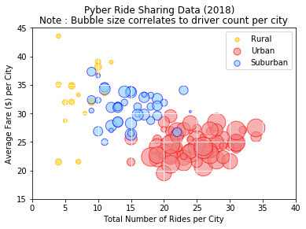
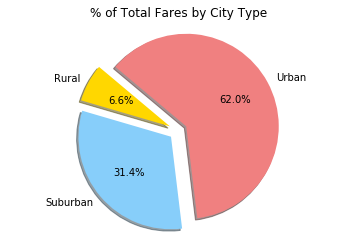
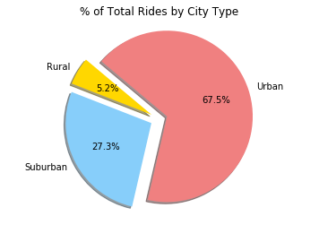

```python
#Import Modules
import os
import numpy as np
import pandas as pd
import matplotlib.pyplot as plt
```


```python
#Import csv files
ride_data_file = file2 = os.path.join('raw_data', 'ride_data.csv')
city_data_file = os.path.join('raw_data', 'city_data.csv')

#Read the files and create data frames
ride_pd = pd.read_csv(ride_data_file)
city_pd = pd.read_csv(city_data_file)
#ride_pd.head()
#city_pd.head()
```


```python
#Prepare and Clean the Data First
#drop duplicated records before merging. 
city_pd2 = city_pd.drop_duplicates('city', keep = 'first')
merged_pyber_df = city_pd.merge(ride_pd, on = 'city')
#merged_pyber_df.head()

#Build a Bubble Plot that showcases the relationship between four key variables:
#Average Fare ($) Per City, Total Number of Rides Per City, Total Number of Drivers Per City, City Type (Urban, Suburban, Rural)
# Because every variable is per city we will have to group by city
df_per_city = merged_pyber_df.groupby('city')

#Total number of rides per city
rides_per_city_pd = df_per_city['ride_id'].count()
#rides_per_city_pd

#Avg fare per city
avg_per_city_pd = df_per_city['fare'].mean()
#avg_per_city_pd

#Number of drivers per city. Not sure if I had to do a .mean() or .count() but in that case will be the same result as rides per city
drivers_per_city_pd = df_per_city['driver_count'].mean()
#drivers_per_city_pd

# City Type
#city_type_df = df_per_city['type'] -> I can't use this because it's not what I need for the DF, it creates lists inside the column. I will have to take the original DF and reset the index
city_type_df2 = city_pd2.set_index('city')['type']
#city_type_df

# Create a data frame with the key variables
bubble_df = pd.DataFrame({'Average Fare per City':avg_per_city_pd,'Number of Rides per City':rides_per_city_pd, 'Number of Drivers per City':drivers_per_city_pd,'City Type':city_type_df2})

#bubble_df.head()
#Restyle and reorder
bubble_df.sort_values('Number of Drivers per City', ascending = True)
bubble_df.style.format({'Average Fare per City': '${:.2f}'})

#Set colors for future Plots
#Rural = gold
Rural_color= '#FFD700'
#Urban = lightcoral
Urban_color = '#F08080' 
#Suburban = lightskyblue
Suburban_color = '#87CEFA'
```


```python
#I still need to split the DF into 3 data frames (defined by the city type) for the bubble plot.
Rural_type = bubble_df[bubble_df['City Type'] == 'Rural']
Urban_type = bubble_df[bubble_df['City Type'] == 'Urban']
Suburban_type = bubble_df[bubble_df['City Type'] == 'Suburban']
```


```python
print('---------- Bubble Plot ----------')
#Define the bubble plots per categories defined above
x_axis = 'Number of Rides per City'
y_axis = 'Average Fare per City'
#I will have to multiply the size of the bubbles for a constant 'c' so is 'c' times bigger and looks better on the chart
s_bubbles = 'Number of Drivers per City'
plt.scatter(Rural_type[x_axis], Rural_type[y_axis], s = 8 * Rural_type[s_bubbles], alpha = 0.60, color = Rural_color, marker = 'o', edgecolor = 'orange', label = 'Rural')
plt.scatter(Urban_type[x_axis], Urban_type[y_axis], s = 8 * Urban_type[s_bubbles], alpha = 0.60, color = Urban_color, marker = 'o', edgecolor = 'red', label = 'Urban')
plt.scatter(Suburban_type[x_axis], Suburban_type[y_axis], s = 8 * Suburban_type[s_bubbles], alpha = 0.60, color = Suburban_color, marker = 'o', edgecolor = 'blue', label = 'Suburban')

#Print the bubble plot
plt.xlabel('Total Number of Rides per City')
plt.ylabel('Average Fare ($) per City')
plt.title('Note : Bubble size correlates to driver count per city')
plt.suptitle('Pyber Ride Sharing Data (2018)')
plt.ylim(15, 45)
plt.xlim(0, 40)

legend =plt.legend()
#Playing with the legend
#plt.legend(loc=0, numpoints=1)
#leg = plt.gca().get_legend()
#ltext  = leg.get_texts()
#plt.setp(ltext, fontsize='small', color = 'red') 
#Setting the grid and the size of the bubles inside the legend
plt.grid(True, color = 'white')
legend.legendHandles[0]._sizes = [30]
legend.legendHandles[1]._sizes = [80]
legend.legendHandles[2]._sizes = [55]
plt.show()
```

    ---------- Bubble Plot ----------





```python
print('---------- Pie Charts ----------')

```

    ---------- Pie Charts ----------


```python
print('Total Fares by City Type')

#I first need to build my DF. I can leverage the initial merged DF but instead of filtering by city I will have to group it by city type
df_per_city_type = merged_pyber_df.groupby('type')

#Calculate the total fares by city type
fare_by_city_type= df_per_city_type['fare'].sum()
#fare_by_city_type

# Labels for the pie chart sections
labels = fare_by_city_type.index

# The values of each section of the pie chart
sizes = fare_by_city_type

# The colors of each section of the pie chart
colors = [Rural_color, Suburban_color, Urban_color]

# Tells matplotlib to separate the "Python" section from the others
explode = (0.1, 0.1, 0.1)

plt.pie(sizes, explode=explode, labels=labels, colors=colors,
        autopct="%1.1f%%", shadow=True, startangle=140)

plt.title('% of Total Fares by City Type')
plt.axis('equal')
plt.show()
```

    Total Fares by City Type





```python
print('Total Rides by City Type')
#I can use the previous DF because it's already grouped by city type
#Calculate the amount of rides by city type
rides_by_city_type= df_per_city_type['ride_id'].count()

# Labels for the pie chart sections
labels = rides_by_city_type.index

# The values of each section of the pie chart
sizes = rides_by_city_type

# The colors of each section of the pie chart
colors = [Rural_color, Suburban_color, Urban_color]

# Tells matplotlib to separate the "Python" section from the others
explode = (0.1, 0.1, 0.1)

plt.pie(sizes, explode=explode, labels=labels, colors=colors,
        autopct="%1.1f%%", shadow=True, startangle=140)

plt.title('% of Total Rides by City Type')
plt.axis('equal')
plt.show()
```

    Total Rides by City Type





```python
print('Total Drivers by City Type')
#I can use the previous DF because it's already grouped by city type
#Calculate the total drivers by city type
drivers_by_city_type= df_per_city_type['driver_count'].sum()

# Labels for the pie chart sections
labels = drivers_by_city_type.index

# The values of each section of the pie chart
sizes = drivers_by_city_type

# The colors of each section of the pie chart
colors = [Rural_color, Suburban_color, Urban_color]

# Tells matplotlib to separate the "Python" section from the others
explode = (0.1, 0.1, 0.1)

plt.pie(sizes, explode=explode, labels=labels, colors=colors,
        autopct="%1.1f%%", shadow=True, startangle=140)

plt.title('% of Total Drivers by City Type')
plt.axis('equal')
plt.show()
```

    Total Drivers by City Type


```python
print('Trend Analysis')
print('There are more drivers in the urban areas than in the rest of the areas. In consecuence there are more rides due to the direct relationship between rides and drivers. The total fares are the highest in urban areas because of the high amount of drivers in the are. However, in the bubble plot we can observe that the average fare for suburban and urban cities is higher than for urban cities, there is no direct correlation between the fares and the amount of drivers.')
```

    Trend Analysis
    There are more drivers in the urban areas than in the rest of the areas. In consecuence there are more rides due to the direct relationship between rides and drivers. The total fares are the highest in urban areas because of the high amount of drivers in the are. However, in the bubble plot we can observe that the average fare for suburban and urban cities is higher than for urban cities, there is no direct correlation between the fares and the amount of drivers.

