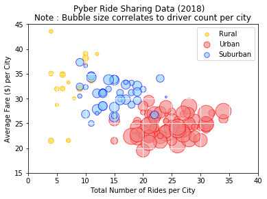
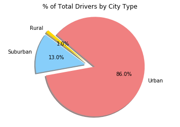

```python
#Import Modules
import os
import numpy as np
import pandas as pd
import matplotlib.pyplot as plt
```


```python
#Import csv files
ride_data_file = file2 = os.path.join('raw_data', 'ride_data.csv')
city_data_file = os.path.join('raw_data', 'city_data.csv')

#Read the files and create data frames
ride_pd = pd.read_csv(ride_data_file)
city_pd = pd.read_csv(city_data_file)
#ride_pd.head()
#city_pd.head()
```


```python
#Prepare and Clean the Data First
#drop duplicated records before merging. 
city_pd2 = city_pd.drop_duplicates('city', keep = 'first')
merged_pyber_df = city_pd.merge(ride_pd, on = 'city')
#merged_pyber_df.head()

#Build a Bubble Plot that showcases the relationship between four key variables:
#Average Fare ($) Per City, Total Number of Rides Per City, Total Number of Drivers Per City, City Type (Urban, Suburban, Rural)
# Because every variable is per city we will have to group by city
df_per_city = merged_pyber_df.groupby('city')

#Total number of rides per city
rides_per_city_pd = df_per_city['ride_id'].count()
#rides_per_city_pd

#Avg fare per city
avg_per_city_pd = df_per_city['fare'].mean()
#avg_per_city_pd

#Number of drivers per city. Not sure if I had to do a .mean() or .count() but in that case will be the same result as rides per city
drivers_per_city_pd = df_per_city['driver_count'].mean()
#drivers_per_city_pd

# City Type
#city_type_df = df_per_city['type'] -> I can't use this because it's not what I need for the DF, it creates lists inside the column. I will have to take the original DF and reset the index
city_type_df2 = city_pd2.set_index('city')['type']
#city_type_df

# Create a data frame with the key variables
bubble_df = pd.DataFrame({'Average Fare per City':avg_per_city_pd,'Number of Rides per City':rides_per_city_pd, 'Number of Drivers per City':drivers_per_city_pd,'City Type':city_type_df2})

#bubble_df.head()
#Restyle and reorder
bubble_df.sort_values('Number of Drivers per City', ascending = True)
bubble_df.style.format({'Average Fare per City': '${:.2f}'})
```


<style  type="text/css" >
</style>  
<table id="T_4dfc6080_202a_11e8_9a6e_3035add8ce64" > 
<thead>    <tr> 
        <th class="blank level0" ></th> 
        <th class="col_heading level0 col0" >Average Fare per City</th> 
        <th class="col_heading level0 col1" >City Type</th> 
        <th class="col_heading level0 col2" >Number of Drivers per City</th> 
        <th class="col_heading level0 col3" >Number of Rides per City</th> 
    </tr></thead> 
<tbody>    <tr> 
        <th id="T_4dfc6080_202a_11e8_9a6e_3035add8ce64level0_row0" class="row_heading level0 row0" >Alvarezhaven</th> 
        <td id="T_4dfc6080_202a_11e8_9a6e_3035add8ce64row0_col0" class="data row0 col0" >$23.93</td> 
        <td id="T_4dfc6080_202a_11e8_9a6e_3035add8ce64row0_col1" class="data row0 col1" >Urban</td> 
        <td id="T_4dfc6080_202a_11e8_9a6e_3035add8ce64row0_col2" class="data row0 col2" >21</td> 
        <td id="T_4dfc6080_202a_11e8_9a6e_3035add8ce64row0_col3" class="data row0 col3" >31</td> 
    </tr>    <tr> 
        <th id="T_4dfc6080_202a_11e8_9a6e_3035add8ce64level0_row1" class="row_heading level0 row1" >Alyssaberg</th> 
        <td id="T_4dfc6080_202a_11e8_9a6e_3035add8ce64row1_col0" class="data row1 col0" >$20.61</td> 
        <td id="T_4dfc6080_202a_11e8_9a6e_3035add8ce64row1_col1" class="data row1 col1" >Urban</td> 
        <td id="T_4dfc6080_202a_11e8_9a6e_3035add8ce64row1_col2" class="data row1 col2" >67</td> 
        <td id="T_4dfc6080_202a_11e8_9a6e_3035add8ce64row1_col3" class="data row1 col3" >26</td> 
    </tr>    <tr> 
        <th id="T_4dfc6080_202a_11e8_9a6e_3035add8ce64level0_row2" class="row_heading level0 row2" >Anitamouth</th> 
        <td id="T_4dfc6080_202a_11e8_9a6e_3035add8ce64row2_col0" class="data row2 col0" >$37.32</td> 
        <td id="T_4dfc6080_202a_11e8_9a6e_3035add8ce64row2_col1" class="data row2 col1" >Suburban</td> 
        <td id="T_4dfc6080_202a_11e8_9a6e_3035add8ce64row2_col2" class="data row2 col2" >16</td> 
        <td id="T_4dfc6080_202a_11e8_9a6e_3035add8ce64row2_col3" class="data row2 col3" >9</td> 
    </tr>    <tr> 
        <th id="T_4dfc6080_202a_11e8_9a6e_3035add8ce64level0_row3" class="row_heading level0 row3" >Antoniomouth</th> 
        <td id="T_4dfc6080_202a_11e8_9a6e_3035add8ce64row3_col0" class="data row3 col0" >$23.62</td> 
        <td id="T_4dfc6080_202a_11e8_9a6e_3035add8ce64row3_col1" class="data row3 col1" >Urban</td> 
        <td id="T_4dfc6080_202a_11e8_9a6e_3035add8ce64row3_col2" class="data row3 col2" >21</td> 
        <td id="T_4dfc6080_202a_11e8_9a6e_3035add8ce64row3_col3" class="data row3 col3" >22</td> 
    </tr>    <tr> 
        <th id="T_4dfc6080_202a_11e8_9a6e_3035add8ce64level0_row4" class="row_heading level0 row4" >Aprilchester</th> 
        <td id="T_4dfc6080_202a_11e8_9a6e_3035add8ce64row4_col0" class="data row4 col0" >$21.98</td> 
        <td id="T_4dfc6080_202a_11e8_9a6e_3035add8ce64row4_col1" class="data row4 col1" >Urban</td> 
        <td id="T_4dfc6080_202a_11e8_9a6e_3035add8ce64row4_col2" class="data row4 col2" >49</td> 
        <td id="T_4dfc6080_202a_11e8_9a6e_3035add8ce64row4_col3" class="data row4 col3" >19</td> 
    </tr>    <tr> 
        <th id="T_4dfc6080_202a_11e8_9a6e_3035add8ce64level0_row5" class="row_heading level0 row5" >Arnoldview</th> 
        <td id="T_4dfc6080_202a_11e8_9a6e_3035add8ce64row5_col0" class="data row5 col0" >$25.11</td> 
        <td id="T_4dfc6080_202a_11e8_9a6e_3035add8ce64row5_col1" class="data row5 col1" >Urban</td> 
        <td id="T_4dfc6080_202a_11e8_9a6e_3035add8ce64row5_col2" class="data row5 col2" >41</td> 
        <td id="T_4dfc6080_202a_11e8_9a6e_3035add8ce64row5_col3" class="data row5 col3" >31</td> 
    </tr>    <tr> 
        <th id="T_4dfc6080_202a_11e8_9a6e_3035add8ce64level0_row6" class="row_heading level0 row6" >Campbellport</th> 
        <td id="T_4dfc6080_202a_11e8_9a6e_3035add8ce64row6_col0" class="data row6 col0" >$33.71</td> 
        <td id="T_4dfc6080_202a_11e8_9a6e_3035add8ce64row6_col1" class="data row6 col1" >Suburban</td> 
        <td id="T_4dfc6080_202a_11e8_9a6e_3035add8ce64row6_col2" class="data row6 col2" >26</td> 
        <td id="T_4dfc6080_202a_11e8_9a6e_3035add8ce64row6_col3" class="data row6 col3" >15</td> 
    </tr>    <tr> 
        <th id="T_4dfc6080_202a_11e8_9a6e_3035add8ce64level0_row7" class="row_heading level0 row7" >Carrollbury</th> 
        <td id="T_4dfc6080_202a_11e8_9a6e_3035add8ce64row7_col0" class="data row7 col0" >$36.61</td> 
        <td id="T_4dfc6080_202a_11e8_9a6e_3035add8ce64row7_col1" class="data row7 col1" >Suburban</td> 
        <td id="T_4dfc6080_202a_11e8_9a6e_3035add8ce64row7_col2" class="data row7 col2" >4</td> 
        <td id="T_4dfc6080_202a_11e8_9a6e_3035add8ce64row7_col3" class="data row7 col3" >10</td> 
    </tr>    <tr> 
        <th id="T_4dfc6080_202a_11e8_9a6e_3035add8ce64level0_row8" class="row_heading level0 row8" >Carrollfort</th> 
        <td id="T_4dfc6080_202a_11e8_9a6e_3035add8ce64row8_col0" class="data row8 col0" >$25.40</td> 
        <td id="T_4dfc6080_202a_11e8_9a6e_3035add8ce64row8_col1" class="data row8 col1" >Urban</td> 
        <td id="T_4dfc6080_202a_11e8_9a6e_3035add8ce64row8_col2" class="data row8 col2" >55</td> 
        <td id="T_4dfc6080_202a_11e8_9a6e_3035add8ce64row8_col3" class="data row8 col3" >29</td> 
    </tr>    <tr> 
        <th id="T_4dfc6080_202a_11e8_9a6e_3035add8ce64level0_row9" class="row_heading level0 row9" >Clarkstad</th> 
        <td id="T_4dfc6080_202a_11e8_9a6e_3035add8ce64row9_col0" class="data row9 col0" >$31.05</td> 
        <td id="T_4dfc6080_202a_11e8_9a6e_3035add8ce64row9_col1" class="data row9 col1" >Suburban</td> 
        <td id="T_4dfc6080_202a_11e8_9a6e_3035add8ce64row9_col2" class="data row9 col2" >21</td> 
        <td id="T_4dfc6080_202a_11e8_9a6e_3035add8ce64row9_col3" class="data row9 col3" >12</td> 
    </tr>    <tr> 
        <th id="T_4dfc6080_202a_11e8_9a6e_3035add8ce64level0_row10" class="row_heading level0 row10" >Conwaymouth</th> 
        <td id="T_4dfc6080_202a_11e8_9a6e_3035add8ce64row10_col0" class="data row10 col0" >$34.59</td> 
        <td id="T_4dfc6080_202a_11e8_9a6e_3035add8ce64row10_col1" class="data row10 col1" >Suburban</td> 
        <td id="T_4dfc6080_202a_11e8_9a6e_3035add8ce64row10_col2" class="data row10 col2" >18</td> 
        <td id="T_4dfc6080_202a_11e8_9a6e_3035add8ce64row10_col3" class="data row10 col3" >11</td> 
    </tr>    <tr> 
        <th id="T_4dfc6080_202a_11e8_9a6e_3035add8ce64level0_row11" class="row_heading level0 row11" >Davidtown</th> 
        <td id="T_4dfc6080_202a_11e8_9a6e_3035add8ce64row11_col0" class="data row11 col0" >$22.98</td> 
        <td id="T_4dfc6080_202a_11e8_9a6e_3035add8ce64row11_col1" class="data row11 col1" >Urban</td> 
        <td id="T_4dfc6080_202a_11e8_9a6e_3035add8ce64row11_col2" class="data row11 col2" >73</td> 
        <td id="T_4dfc6080_202a_11e8_9a6e_3035add8ce64row11_col3" class="data row11 col3" >21</td> 
    </tr>    <tr> 
        <th id="T_4dfc6080_202a_11e8_9a6e_3035add8ce64level0_row12" class="row_heading level0 row12" >Davistown</th> 
        <td id="T_4dfc6080_202a_11e8_9a6e_3035add8ce64row12_col0" class="data row12 col0" >$21.50</td> 
        <td id="T_4dfc6080_202a_11e8_9a6e_3035add8ce64row12_col1" class="data row12 col1" >Urban</td> 
        <td id="T_4dfc6080_202a_11e8_9a6e_3035add8ce64row12_col2" class="data row12 col2" >25</td> 
        <td id="T_4dfc6080_202a_11e8_9a6e_3035add8ce64row12_col3" class="data row12 col3" >25</td> 
    </tr>    <tr> 
        <th id="T_4dfc6080_202a_11e8_9a6e_3035add8ce64level0_row13" class="row_heading level0 row13" >East Cherylfurt</th> 
        <td id="T_4dfc6080_202a_11e8_9a6e_3035add8ce64row13_col0" class="data row13 col0" >$31.42</td> 
        <td id="T_4dfc6080_202a_11e8_9a6e_3035add8ce64row13_col1" class="data row13 col1" >Suburban</td> 
        <td id="T_4dfc6080_202a_11e8_9a6e_3035add8ce64row13_col2" class="data row13 col2" >9</td> 
        <td id="T_4dfc6080_202a_11e8_9a6e_3035add8ce64row13_col3" class="data row13 col3" >13</td> 
    </tr>    <tr> 
        <th id="T_4dfc6080_202a_11e8_9a6e_3035add8ce64level0_row14" class="row_heading level0 row14" >East Douglas</th> 
        <td id="T_4dfc6080_202a_11e8_9a6e_3035add8ce64row14_col0" class="data row14 col0" >$26.17</td> 
        <td id="T_4dfc6080_202a_11e8_9a6e_3035add8ce64row14_col1" class="data row14 col1" >Urban</td> 
        <td id="T_4dfc6080_202a_11e8_9a6e_3035add8ce64row14_col2" class="data row14 col2" >12</td> 
        <td id="T_4dfc6080_202a_11e8_9a6e_3035add8ce64row14_col3" class="data row14 col3" >22</td> 
    </tr>    <tr> 
        <th id="T_4dfc6080_202a_11e8_9a6e_3035add8ce64level0_row15" class="row_heading level0 row15" >East Erin</th> 
        <td id="T_4dfc6080_202a_11e8_9a6e_3035add8ce64row15_col0" class="data row15 col0" >$24.48</td> 
        <td id="T_4dfc6080_202a_11e8_9a6e_3035add8ce64row15_col1" class="data row15 col1" >Urban</td> 
        <td id="T_4dfc6080_202a_11e8_9a6e_3035add8ce64row15_col2" class="data row15 col2" >43</td> 
        <td id="T_4dfc6080_202a_11e8_9a6e_3035add8ce64row15_col3" class="data row15 col3" >28</td> 
    </tr>    <tr> 
        <th id="T_4dfc6080_202a_11e8_9a6e_3035add8ce64level0_row16" class="row_heading level0 row16" >East Jenniferchester</th> 
        <td id="T_4dfc6080_202a_11e8_9a6e_3035add8ce64row16_col0" class="data row16 col0" >$32.60</td> 
        <td id="T_4dfc6080_202a_11e8_9a6e_3035add8ce64row16_col1" class="data row16 col1" >Suburban</td> 
        <td id="T_4dfc6080_202a_11e8_9a6e_3035add8ce64row16_col2" class="data row16 col2" >22</td> 
        <td id="T_4dfc6080_202a_11e8_9a6e_3035add8ce64row16_col3" class="data row16 col3" >19</td> 
    </tr>    <tr> 
        <th id="T_4dfc6080_202a_11e8_9a6e_3035add8ce64level0_row17" class="row_heading level0 row17" >East Leslie</th> 
        <td id="T_4dfc6080_202a_11e8_9a6e_3035add8ce64row17_col0" class="data row17 col0" >$33.66</td> 
        <td id="T_4dfc6080_202a_11e8_9a6e_3035add8ce64row17_col1" class="data row17 col1" >Rural</td> 
        <td id="T_4dfc6080_202a_11e8_9a6e_3035add8ce64row17_col2" class="data row17 col2" >9</td> 
        <td id="T_4dfc6080_202a_11e8_9a6e_3035add8ce64row17_col3" class="data row17 col3" >11</td> 
    </tr>    <tr> 
        <th id="T_4dfc6080_202a_11e8_9a6e_3035add8ce64level0_row18" class="row_heading level0 row18" >East Stephen</th> 
        <td id="T_4dfc6080_202a_11e8_9a6e_3035add8ce64row18_col0" class="data row18 col0" >$39.05</td> 
        <td id="T_4dfc6080_202a_11e8_9a6e_3035add8ce64row18_col1" class="data row18 col1" >Rural</td> 
        <td id="T_4dfc6080_202a_11e8_9a6e_3035add8ce64row18_col2" class="data row18 col2" >6</td> 
        <td id="T_4dfc6080_202a_11e8_9a6e_3035add8ce64row18_col3" class="data row18 col3" >10</td> 
    </tr>    <tr> 
        <th id="T_4dfc6080_202a_11e8_9a6e_3035add8ce64level0_row19" class="row_heading level0 row19" >East Troybury</th> 
        <td id="T_4dfc6080_202a_11e8_9a6e_3035add8ce64row19_col0" class="data row19 col0" >$33.24</td> 
        <td id="T_4dfc6080_202a_11e8_9a6e_3035add8ce64row19_col1" class="data row19 col1" >Rural</td> 
        <td id="T_4dfc6080_202a_11e8_9a6e_3035add8ce64row19_col2" class="data row19 col2" >3</td> 
        <td id="T_4dfc6080_202a_11e8_9a6e_3035add8ce64row19_col3" class="data row19 col3" >7</td> 
    </tr>    <tr> 
        <th id="T_4dfc6080_202a_11e8_9a6e_3035add8ce64level0_row20" class="row_heading level0 row20" >Edwardsbury</th> 
        <td id="T_4dfc6080_202a_11e8_9a6e_3035add8ce64row20_col0" class="data row20 col0" >$26.88</td> 
        <td id="T_4dfc6080_202a_11e8_9a6e_3035add8ce64row20_col1" class="data row20 col1" >Urban</td> 
        <td id="T_4dfc6080_202a_11e8_9a6e_3035add8ce64row20_col2" class="data row20 col2" >11</td> 
        <td id="T_4dfc6080_202a_11e8_9a6e_3035add8ce64row20_col3" class="data row20 col3" >27</td> 
    </tr>    <tr> 
        <th id="T_4dfc6080_202a_11e8_9a6e_3035add8ce64level0_row21" class="row_heading level0 row21" >Erikport</th> 
        <td id="T_4dfc6080_202a_11e8_9a6e_3035add8ce64row21_col0" class="data row21 col0" >$30.04</td> 
        <td id="T_4dfc6080_202a_11e8_9a6e_3035add8ce64row21_col1" class="data row21 col1" >Rural</td> 
        <td id="T_4dfc6080_202a_11e8_9a6e_3035add8ce64row21_col2" class="data row21 col2" >3</td> 
        <td id="T_4dfc6080_202a_11e8_9a6e_3035add8ce64row21_col3" class="data row21 col3" >8</td> 
    </tr>    <tr> 
        <th id="T_4dfc6080_202a_11e8_9a6e_3035add8ce64level0_row22" class="row_heading level0 row22" >Eriktown</th> 
        <td id="T_4dfc6080_202a_11e8_9a6e_3035add8ce64row22_col0" class="data row22 col0" >$25.48</td> 
        <td id="T_4dfc6080_202a_11e8_9a6e_3035add8ce64row22_col1" class="data row22 col1" >Urban</td> 
        <td id="T_4dfc6080_202a_11e8_9a6e_3035add8ce64row22_col2" class="data row22 col2" >15</td> 
        <td id="T_4dfc6080_202a_11e8_9a6e_3035add8ce64row22_col3" class="data row22 col3" >19</td> 
    </tr>    <tr> 
        <th id="T_4dfc6080_202a_11e8_9a6e_3035add8ce64level0_row23" class="row_heading level0 row23" >Floresberg</th> 
        <td id="T_4dfc6080_202a_11e8_9a6e_3035add8ce64row23_col0" class="data row23 col0" >$32.31</td> 
        <td id="T_4dfc6080_202a_11e8_9a6e_3035add8ce64row23_col1" class="data row23 col1" >Suburban</td> 
        <td id="T_4dfc6080_202a_11e8_9a6e_3035add8ce64row23_col2" class="data row23 col2" >7</td> 
        <td id="T_4dfc6080_202a_11e8_9a6e_3035add8ce64row23_col3" class="data row23 col3" >10</td> 
    </tr>    <tr> 
        <th id="T_4dfc6080_202a_11e8_9a6e_3035add8ce64level0_row24" class="row_heading level0 row24" >Fosterside</th> 
        <td id="T_4dfc6080_202a_11e8_9a6e_3035add8ce64row24_col0" class="data row24 col0" >$23.03</td> 
        <td id="T_4dfc6080_202a_11e8_9a6e_3035add8ce64row24_col1" class="data row24 col1" >Urban</td> 
        <td id="T_4dfc6080_202a_11e8_9a6e_3035add8ce64row24_col2" class="data row24 col2" >69</td> 
        <td id="T_4dfc6080_202a_11e8_9a6e_3035add8ce64row24_col3" class="data row24 col3" >24</td> 
    </tr>    <tr> 
        <th id="T_4dfc6080_202a_11e8_9a6e_3035add8ce64level0_row25" class="row_heading level0 row25" >Hernandezshire</th> 
        <td id="T_4dfc6080_202a_11e8_9a6e_3035add8ce64row25_col0" class="data row25 col0" >$32.00</td> 
        <td id="T_4dfc6080_202a_11e8_9a6e_3035add8ce64row25_col1" class="data row25 col1" >Rural</td> 
        <td id="T_4dfc6080_202a_11e8_9a6e_3035add8ce64row25_col2" class="data row25 col2" >10</td> 
        <td id="T_4dfc6080_202a_11e8_9a6e_3035add8ce64row25_col3" class="data row25 col3" >9</td> 
    </tr>    <tr> 
        <th id="T_4dfc6080_202a_11e8_9a6e_3035add8ce64level0_row26" class="row_heading level0 row26" >Horneland</th> 
        <td id="T_4dfc6080_202a_11e8_9a6e_3035add8ce64row26_col0" class="data row26 col0" >$21.48</td> 
        <td id="T_4dfc6080_202a_11e8_9a6e_3035add8ce64row26_col1" class="data row26 col1" >Rural</td> 
        <td id="T_4dfc6080_202a_11e8_9a6e_3035add8ce64row26_col2" class="data row26 col2" >8</td> 
        <td id="T_4dfc6080_202a_11e8_9a6e_3035add8ce64row26_col3" class="data row26 col3" >4</td> 
    </tr>    <tr> 
        <th id="T_4dfc6080_202a_11e8_9a6e_3035add8ce64level0_row27" class="row_heading level0 row27" >Jacksonfort</th> 
        <td id="T_4dfc6080_202a_11e8_9a6e_3035add8ce64row27_col0" class="data row27 col0" >$32.01</td> 
        <td id="T_4dfc6080_202a_11e8_9a6e_3035add8ce64row27_col1" class="data row27 col1" >Rural</td> 
        <td id="T_4dfc6080_202a_11e8_9a6e_3035add8ce64row27_col2" class="data row27 col2" >6</td> 
        <td id="T_4dfc6080_202a_11e8_9a6e_3035add8ce64row27_col3" class="data row27 col3" >6</td> 
    </tr>    <tr> 
        <th id="T_4dfc6080_202a_11e8_9a6e_3035add8ce64level0_row28" class="row_heading level0 row28" >Jacobfort</th> 
        <td id="T_4dfc6080_202a_11e8_9a6e_3035add8ce64row28_col0" class="data row28 col0" >$24.78</td> 
        <td id="T_4dfc6080_202a_11e8_9a6e_3035add8ce64row28_col1" class="data row28 col1" >Urban</td> 
        <td id="T_4dfc6080_202a_11e8_9a6e_3035add8ce64row28_col2" class="data row28 col2" >52</td> 
        <td id="T_4dfc6080_202a_11e8_9a6e_3035add8ce64row28_col3" class="data row28 col3" >31</td> 
    </tr>    <tr> 
        <th id="T_4dfc6080_202a_11e8_9a6e_3035add8ce64level0_row29" class="row_heading level0 row29" >Jasonfort</th> 
        <td id="T_4dfc6080_202a_11e8_9a6e_3035add8ce64row29_col0" class="data row29 col0" >$27.83</td> 
        <td id="T_4dfc6080_202a_11e8_9a6e_3035add8ce64row29_col1" class="data row29 col1" >Suburban</td> 
        <td id="T_4dfc6080_202a_11e8_9a6e_3035add8ce64row29_col2" class="data row29 col2" >25</td> 
        <td id="T_4dfc6080_202a_11e8_9a6e_3035add8ce64row29_col3" class="data row29 col3" >12</td> 
    </tr>    <tr> 
        <th id="T_4dfc6080_202a_11e8_9a6e_3035add8ce64level0_row30" class="row_heading level0 row30" >Jeffreyton</th> 
        <td id="T_4dfc6080_202a_11e8_9a6e_3035add8ce64row30_col0" class="data row30 col0" >$33.17</td> 
        <td id="T_4dfc6080_202a_11e8_9a6e_3035add8ce64row30_col1" class="data row30 col1" >Suburban</td> 
        <td id="T_4dfc6080_202a_11e8_9a6e_3035add8ce64row30_col2" class="data row30 col2" >8</td> 
        <td id="T_4dfc6080_202a_11e8_9a6e_3035add8ce64row30_col3" class="data row30 col3" >18</td> 
    </tr>    <tr> 
        <th id="T_4dfc6080_202a_11e8_9a6e_3035add8ce64level0_row31" class="row_heading level0 row31" >Johnland</th> 
        <td id="T_4dfc6080_202a_11e8_9a6e_3035add8ce64row31_col0" class="data row31 col0" >$28.75</td> 
        <td id="T_4dfc6080_202a_11e8_9a6e_3035add8ce64row31_col1" class="data row31 col1" >Suburban</td> 
        <td id="T_4dfc6080_202a_11e8_9a6e_3035add8ce64row31_col2" class="data row31 col2" >13</td> 
        <td id="T_4dfc6080_202a_11e8_9a6e_3035add8ce64row31_col3" class="data row31 col3" >18</td> 
    </tr>    <tr> 
        <th id="T_4dfc6080_202a_11e8_9a6e_3035add8ce64level0_row32" class="row_heading level0 row32" >Kellershire</th> 
        <td id="T_4dfc6080_202a_11e8_9a6e_3035add8ce64row32_col0" class="data row32 col0" >$24.17</td> 
        <td id="T_4dfc6080_202a_11e8_9a6e_3035add8ce64row32_col1" class="data row32 col1" >Urban</td> 
        <td id="T_4dfc6080_202a_11e8_9a6e_3035add8ce64row32_col2" class="data row32 col2" >51</td> 
        <td id="T_4dfc6080_202a_11e8_9a6e_3035add8ce64row32_col3" class="data row32 col3" >19</td> 
    </tr>    <tr> 
        <th id="T_4dfc6080_202a_11e8_9a6e_3035add8ce64level0_row33" class="row_heading level0 row33" >Kelseyland</th> 
        <td id="T_4dfc6080_202a_11e8_9a6e_3035add8ce64row33_col0" class="data row33 col0" >$21.81</td> 
        <td id="T_4dfc6080_202a_11e8_9a6e_3035add8ce64row33_col1" class="data row33 col1" >Urban</td> 
        <td id="T_4dfc6080_202a_11e8_9a6e_3035add8ce64row33_col2" class="data row33 col2" >63</td> 
        <td id="T_4dfc6080_202a_11e8_9a6e_3035add8ce64row33_col3" class="data row33 col3" >28</td> 
    </tr>    <tr> 
        <th id="T_4dfc6080_202a_11e8_9a6e_3035add8ce64level0_row34" class="row_heading level0 row34" >Kennethburgh</th> 
        <td id="T_4dfc6080_202a_11e8_9a6e_3035add8ce64row34_col0" class="data row34 col0" >$36.93</td> 
        <td id="T_4dfc6080_202a_11e8_9a6e_3035add8ce64row34_col1" class="data row34 col1" >Rural</td> 
        <td id="T_4dfc6080_202a_11e8_9a6e_3035add8ce64row34_col2" class="data row34 col2" >3</td> 
        <td id="T_4dfc6080_202a_11e8_9a6e_3035add8ce64row34_col3" class="data row34 col3" >10</td> 
    </tr>    <tr> 
        <th id="T_4dfc6080_202a_11e8_9a6e_3035add8ce64level0_row35" class="row_heading level0 row35" >Kimberlychester</th> 
        <td id="T_4dfc6080_202a_11e8_9a6e_3035add8ce64row35_col0" class="data row35 col0" >$22.95</td> 
        <td id="T_4dfc6080_202a_11e8_9a6e_3035add8ce64row35_col1" class="data row35 col1" >Urban</td> 
        <td id="T_4dfc6080_202a_11e8_9a6e_3035add8ce64row35_col2" class="data row35 col2" >13</td> 
        <td id="T_4dfc6080_202a_11e8_9a6e_3035add8ce64row35_col3" class="data row35 col3" >27</td> 
    </tr>    <tr> 
        <th id="T_4dfc6080_202a_11e8_9a6e_3035add8ce64level0_row36" class="row_heading level0 row36" >Kinghaven</th> 
        <td id="T_4dfc6080_202a_11e8_9a6e_3035add8ce64row36_col0" class="data row36 col0" >$34.98</td> 
        <td id="T_4dfc6080_202a_11e8_9a6e_3035add8ce64row36_col1" class="data row36 col1" >Rural</td> 
        <td id="T_4dfc6080_202a_11e8_9a6e_3035add8ce64row36_col2" class="data row36 col2" >3</td> 
        <td id="T_4dfc6080_202a_11e8_9a6e_3035add8ce64row36_col3" class="data row36 col3" >6</td> 
    </tr>    <tr> 
        <th id="T_4dfc6080_202a_11e8_9a6e_3035add8ce64level0_row37" class="row_heading level0 row37" >Kyleton</th> 
        <td id="T_4dfc6080_202a_11e8_9a6e_3035add8ce64row37_col0" class="data row37 col0" >$31.17</td> 
        <td id="T_4dfc6080_202a_11e8_9a6e_3035add8ce64row37_col1" class="data row37 col1" >Suburban</td> 
        <td id="T_4dfc6080_202a_11e8_9a6e_3035add8ce64row37_col2" class="data row37 col2" >12</td> 
        <td id="T_4dfc6080_202a_11e8_9a6e_3035add8ce64row37_col3" class="data row37 col3" >16</td> 
    </tr>    <tr> 
        <th id="T_4dfc6080_202a_11e8_9a6e_3035add8ce64level0_row38" class="row_heading level0 row38" >Lake Brenda</th> 
        <td id="T_4dfc6080_202a_11e8_9a6e_3035add8ce64row38_col0" class="data row38 col0" >$29.79</td> 
        <td id="T_4dfc6080_202a_11e8_9a6e_3035add8ce64row38_col1" class="data row38 col1" >Suburban</td> 
        <td id="T_4dfc6080_202a_11e8_9a6e_3035add8ce64row38_col2" class="data row38 col2" >24</td> 
        <td id="T_4dfc6080_202a_11e8_9a6e_3035add8ce64row38_col3" class="data row38 col3" >17</td> 
    </tr>    <tr> 
        <th id="T_4dfc6080_202a_11e8_9a6e_3035add8ce64level0_row39" class="row_heading level0 row39" >Lake Jeffreyland</th> 
        <td id="T_4dfc6080_202a_11e8_9a6e_3035add8ce64row39_col0" class="data row39 col0" >$27.33</td> 
        <td id="T_4dfc6080_202a_11e8_9a6e_3035add8ce64row39_col1" class="data row39 col1" >Urban</td> 
        <td id="T_4dfc6080_202a_11e8_9a6e_3035add8ce64row39_col2" class="data row39 col2" >15</td> 
        <td id="T_4dfc6080_202a_11e8_9a6e_3035add8ce64row39_col3" class="data row39 col3" >25</td> 
    </tr>    <tr> 
        <th id="T_4dfc6080_202a_11e8_9a6e_3035add8ce64level0_row40" class="row_heading level0 row40" >Lake Jennaton</th> 
        <td id="T_4dfc6080_202a_11e8_9a6e_3035add8ce64row40_col0" class="data row40 col0" >$25.35</td> 
        <td id="T_4dfc6080_202a_11e8_9a6e_3035add8ce64row40_col1" class="data row40 col1" >Urban</td> 
        <td id="T_4dfc6080_202a_11e8_9a6e_3035add8ce64row40_col2" class="data row40 col2" >65</td> 
        <td id="T_4dfc6080_202a_11e8_9a6e_3035add8ce64row40_col3" class="data row40 col3" >25</td> 
    </tr>    <tr> 
        <th id="T_4dfc6080_202a_11e8_9a6e_3035add8ce64level0_row41" class="row_heading level0 row41" >Lake Sarashire</th> 
        <td id="T_4dfc6080_202a_11e8_9a6e_3035add8ce64row41_col0" class="data row41 col0" >$26.61</td> 
        <td id="T_4dfc6080_202a_11e8_9a6e_3035add8ce64row41_col1" class="data row41 col1" >Urban</td> 
        <td id="T_4dfc6080_202a_11e8_9a6e_3035add8ce64row41_col2" class="data row41 col2" >8</td> 
        <td id="T_4dfc6080_202a_11e8_9a6e_3035add8ce64row41_col3" class="data row41 col3" >22</td> 
    </tr>    <tr> 
        <th id="T_4dfc6080_202a_11e8_9a6e_3035add8ce64level0_row42" class="row_heading level0 row42" >Lake Stevenbury</th> 
        <td id="T_4dfc6080_202a_11e8_9a6e_3035add8ce64row42_col0" class="data row42 col0" >$24.66</td> 
        <td id="T_4dfc6080_202a_11e8_9a6e_3035add8ce64row42_col1" class="data row42 col1" >Urban</td> 
        <td id="T_4dfc6080_202a_11e8_9a6e_3035add8ce64row42_col2" class="data row42 col2" >63</td> 
        <td id="T_4dfc6080_202a_11e8_9a6e_3035add8ce64row42_col3" class="data row42 col3" >21</td> 
    </tr>    <tr> 
        <th id="T_4dfc6080_202a_11e8_9a6e_3035add8ce64level0_row43" class="row_heading level0 row43" >Lisatown</th> 
        <td id="T_4dfc6080_202a_11e8_9a6e_3035add8ce64row43_col0" class="data row43 col0" >$22.23</td> 
        <td id="T_4dfc6080_202a_11e8_9a6e_3035add8ce64row43_col1" class="data row43 col1" >Urban</td> 
        <td id="T_4dfc6080_202a_11e8_9a6e_3035add8ce64row43_col2" class="data row43 col2" >47</td> 
        <td id="T_4dfc6080_202a_11e8_9a6e_3035add8ce64row43_col3" class="data row43 col3" >23</td> 
    </tr>    <tr> 
        <th id="T_4dfc6080_202a_11e8_9a6e_3035add8ce64level0_row44" class="row_heading level0 row44" >Lisaville</th> 
        <td id="T_4dfc6080_202a_11e8_9a6e_3035add8ce64row44_col0" class="data row44 col0" >$28.43</td> 
        <td id="T_4dfc6080_202a_11e8_9a6e_3035add8ce64row44_col1" class="data row44 col1" >Urban</td> 
        <td id="T_4dfc6080_202a_11e8_9a6e_3035add8ce64row44_col2" class="data row44 col2" >66</td> 
        <td id="T_4dfc6080_202a_11e8_9a6e_3035add8ce64row44_col3" class="data row44 col3" >28</td> 
    </tr>    <tr> 
        <th id="T_4dfc6080_202a_11e8_9a6e_3035add8ce64level0_row45" class="row_heading level0 row45" >Manuelchester</th> 
        <td id="T_4dfc6080_202a_11e8_9a6e_3035add8ce64row45_col0" class="data row45 col0" >$49.62</td> 
        <td id="T_4dfc6080_202a_11e8_9a6e_3035add8ce64row45_col1" class="data row45 col1" >Rural</td> 
        <td id="T_4dfc6080_202a_11e8_9a6e_3035add8ce64row45_col2" class="data row45 col2" >7</td> 
        <td id="T_4dfc6080_202a_11e8_9a6e_3035add8ce64row45_col3" class="data row45 col3" >1</td> 
    </tr>    <tr> 
        <th id="T_4dfc6080_202a_11e8_9a6e_3035add8ce64level0_row46" class="row_heading level0 row46" >Martinmouth</th> 
        <td id="T_4dfc6080_202a_11e8_9a6e_3035add8ce64row46_col0" class="data row46 col0" >$30.50</td> 
        <td id="T_4dfc6080_202a_11e8_9a6e_3035add8ce64row46_col1" class="data row46 col1" >Suburban</td> 
        <td id="T_4dfc6080_202a_11e8_9a6e_3035add8ce64row46_col2" class="data row46 col2" >5</td> 
        <td id="T_4dfc6080_202a_11e8_9a6e_3035add8ce64row46_col3" class="data row46 col3" >9</td> 
    </tr>    <tr> 
        <th id="T_4dfc6080_202a_11e8_9a6e_3035add8ce64level0_row47" class="row_heading level0 row47" >Maryside</th> 
        <td id="T_4dfc6080_202a_11e8_9a6e_3035add8ce64row47_col0" class="data row47 col0" >$26.84</td> 
        <td id="T_4dfc6080_202a_11e8_9a6e_3035add8ce64row47_col1" class="data row47 col1" >Urban</td> 
        <td id="T_4dfc6080_202a_11e8_9a6e_3035add8ce64row47_col2" class="data row47 col2" >20</td> 
        <td id="T_4dfc6080_202a_11e8_9a6e_3035add8ce64row47_col3" class="data row47 col3" >21</td> 
    </tr>    <tr> 
        <th id="T_4dfc6080_202a_11e8_9a6e_3035add8ce64level0_row48" class="row_heading level0 row48" >Matthewside</th> 
        <td id="T_4dfc6080_202a_11e8_9a6e_3035add8ce64row48_col0" class="data row48 col0" >$43.53</td> 
        <td id="T_4dfc6080_202a_11e8_9a6e_3035add8ce64row48_col1" class="data row48 col1" >Rural</td> 
        <td id="T_4dfc6080_202a_11e8_9a6e_3035add8ce64row48_col2" class="data row48 col2" >4</td> 
        <td id="T_4dfc6080_202a_11e8_9a6e_3035add8ce64row48_col3" class="data row48 col3" >4</td> 
    </tr>    <tr> 
        <th id="T_4dfc6080_202a_11e8_9a6e_3035add8ce64level0_row49" class="row_heading level0 row49" >Mooreview</th> 
        <td id="T_4dfc6080_202a_11e8_9a6e_3035add8ce64row49_col0" class="data row49 col0" >$29.52</td> 
        <td id="T_4dfc6080_202a_11e8_9a6e_3035add8ce64row49_col1" class="data row49 col1" >Urban</td> 
        <td id="T_4dfc6080_202a_11e8_9a6e_3035add8ce64row49_col2" class="data row49 col2" >34</td> 
        <td id="T_4dfc6080_202a_11e8_9a6e_3035add8ce64row49_col3" class="data row49 col3" >21</td> 
    </tr>    <tr> 
        <th id="T_4dfc6080_202a_11e8_9a6e_3035add8ce64level0_row50" class="row_heading level0 row50" >New Aaron</th> 
        <td id="T_4dfc6080_202a_11e8_9a6e_3035add8ce64row50_col0" class="data row50 col0" >$26.86</td> 
        <td id="T_4dfc6080_202a_11e8_9a6e_3035add8ce64row50_col1" class="data row50 col1" >Urban</td> 
        <td id="T_4dfc6080_202a_11e8_9a6e_3035add8ce64row50_col2" class="data row50 col2" >60</td> 
        <td id="T_4dfc6080_202a_11e8_9a6e_3035add8ce64row50_col3" class="data row50 col3" >22</td> 
    </tr>    <tr> 
        <th id="T_4dfc6080_202a_11e8_9a6e_3035add8ce64level0_row51" class="row_heading level0 row51" >New Andreamouth</th> 
        <td id="T_4dfc6080_202a_11e8_9a6e_3035add8ce64row51_col0" class="data row51 col0" >$24.97</td> 
        <td id="T_4dfc6080_202a_11e8_9a6e_3035add8ce64row51_col1" class="data row51 col1" >Urban</td> 
        <td id="T_4dfc6080_202a_11e8_9a6e_3035add8ce64row51_col2" class="data row51 col2" >42</td> 
        <td id="T_4dfc6080_202a_11e8_9a6e_3035add8ce64row51_col3" class="data row51 col3" >28</td> 
    </tr>    <tr> 
        <th id="T_4dfc6080_202a_11e8_9a6e_3035add8ce64level0_row52" class="row_heading level0 row52" >New Brandonborough</th> 
        <td id="T_4dfc6080_202a_11e8_9a6e_3035add8ce64row52_col0" class="data row52 col0" >$31.90</td> 
        <td id="T_4dfc6080_202a_11e8_9a6e_3035add8ce64row52_col1" class="data row52 col1" >Suburban</td> 
        <td id="T_4dfc6080_202a_11e8_9a6e_3035add8ce64row52_col2" class="data row52 col2" >9</td> 
        <td id="T_4dfc6080_202a_11e8_9a6e_3035add8ce64row52_col3" class="data row52 col3" >14</td> 
    </tr>    <tr> 
        <th id="T_4dfc6080_202a_11e8_9a6e_3035add8ce64level0_row53" class="row_heading level0 row53" >New Christine</th> 
        <td id="T_4dfc6080_202a_11e8_9a6e_3035add8ce64row53_col0" class="data row53 col0" >$24.16</td> 
        <td id="T_4dfc6080_202a_11e8_9a6e_3035add8ce64row53_col1" class="data row53 col1" >Urban</td> 
        <td id="T_4dfc6080_202a_11e8_9a6e_3035add8ce64row53_col2" class="data row53 col2" >22</td> 
        <td id="T_4dfc6080_202a_11e8_9a6e_3035add8ce64row53_col3" class="data row53 col3" >22</td> 
    </tr>    <tr> 
        <th id="T_4dfc6080_202a_11e8_9a6e_3035add8ce64level0_row54" class="row_heading level0 row54" >New Cindyborough</th> 
        <td id="T_4dfc6080_202a_11e8_9a6e_3035add8ce64row54_col0" class="data row54 col0" >$31.03</td> 
        <td id="T_4dfc6080_202a_11e8_9a6e_3035add8ce64row54_col1" class="data row54 col1" >Suburban</td> 
        <td id="T_4dfc6080_202a_11e8_9a6e_3035add8ce64row54_col2" class="data row54 col2" >20</td> 
        <td id="T_4dfc6080_202a_11e8_9a6e_3035add8ce64row54_col3" class="data row54 col3" >13</td> 
    </tr>    <tr> 
        <th id="T_4dfc6080_202a_11e8_9a6e_3035add8ce64level0_row55" class="row_heading level0 row55" >New David</th> 
        <td id="T_4dfc6080_202a_11e8_9a6e_3035add8ce64row55_col0" class="data row55 col0" >$27.08</td> 
        <td id="T_4dfc6080_202a_11e8_9a6e_3035add8ce64row55_col1" class="data row55 col1" >Urban</td> 
        <td id="T_4dfc6080_202a_11e8_9a6e_3035add8ce64row55_col2" class="data row55 col2" >31</td> 
        <td id="T_4dfc6080_202a_11e8_9a6e_3035add8ce64row55_col3" class="data row55 col3" >28</td> 
    </tr>    <tr> 
        <th id="T_4dfc6080_202a_11e8_9a6e_3035add8ce64level0_row56" class="row_heading level0 row56" >New Jeffrey</th> 
        <td id="T_4dfc6080_202a_11e8_9a6e_3035add8ce64row56_col0" class="data row56 col0" >$24.13</td> 
        <td id="T_4dfc6080_202a_11e8_9a6e_3035add8ce64row56_col1" class="data row56 col1" >Urban</td> 
        <td id="T_4dfc6080_202a_11e8_9a6e_3035add8ce64row56_col2" class="data row56 col2" >58</td> 
        <td id="T_4dfc6080_202a_11e8_9a6e_3035add8ce64row56_col3" class="data row56 col3" >25</td> 
    </tr>    <tr> 
        <th id="T_4dfc6080_202a_11e8_9a6e_3035add8ce64level0_row57" class="row_heading level0 row57" >New Jessicamouth</th> 
        <td id="T_4dfc6080_202a_11e8_9a6e_3035add8ce64row57_col0" class="data row57 col0" >$32.81</td> 
        <td id="T_4dfc6080_202a_11e8_9a6e_3035add8ce64row57_col1" class="data row57 col1" >Suburban</td> 
        <td id="T_4dfc6080_202a_11e8_9a6e_3035add8ce64row57_col2" class="data row57 col2" >22</td> 
        <td id="T_4dfc6080_202a_11e8_9a6e_3035add8ce64row57_col3" class="data row57 col3" >17</td> 
    </tr>    <tr> 
        <th id="T_4dfc6080_202a_11e8_9a6e_3035add8ce64level0_row58" class="row_heading level0 row58" >New Johnbury</th> 
        <td id="T_4dfc6080_202a_11e8_9a6e_3035add8ce64row58_col0" class="data row58 col0" >$35.04</td> 
        <td id="T_4dfc6080_202a_11e8_9a6e_3035add8ce64row58_col1" class="data row58 col1" >Rural</td> 
        <td id="T_4dfc6080_202a_11e8_9a6e_3035add8ce64row58_col2" class="data row58 col2" >6</td> 
        <td id="T_4dfc6080_202a_11e8_9a6e_3035add8ce64row58_col3" class="data row58 col3" >4</td> 
    </tr>    <tr> 
        <th id="T_4dfc6080_202a_11e8_9a6e_3035add8ce64level0_row59" class="row_heading level0 row59" >New Lynn</th> 
        <td id="T_4dfc6080_202a_11e8_9a6e_3035add8ce64row59_col0" class="data row59 col0" >$28.45</td> 
        <td id="T_4dfc6080_202a_11e8_9a6e_3035add8ce64row59_col1" class="data row59 col1" >Suburban</td> 
        <td id="T_4dfc6080_202a_11e8_9a6e_3035add8ce64row59_col2" class="data row59 col2" >20</td> 
        <td id="T_4dfc6080_202a_11e8_9a6e_3035add8ce64row59_col3" class="data row59 col3" >13</td> 
    </tr>    <tr> 
        <th id="T_4dfc6080_202a_11e8_9a6e_3035add8ce64level0_row60" class="row_heading level0 row60" >New Maryport</th> 
        <td id="T_4dfc6080_202a_11e8_9a6e_3035add8ce64row60_col0" class="data row60 col0" >$28.47</td> 
        <td id="T_4dfc6080_202a_11e8_9a6e_3035add8ce64row60_col1" class="data row60 col1" >Urban</td> 
        <td id="T_4dfc6080_202a_11e8_9a6e_3035add8ce64row60_col2" class="data row60 col2" >26</td> 
        <td id="T_4dfc6080_202a_11e8_9a6e_3035add8ce64row60_col3" class="data row60 col3" >20</td> 
    </tr>    <tr> 
        <th id="T_4dfc6080_202a_11e8_9a6e_3035add8ce64level0_row61" class="row_heading level0 row61" >New Michelleberg</th> 
        <td id="T_4dfc6080_202a_11e8_9a6e_3035add8ce64row61_col0" class="data row61 col0" >$24.97</td> 
        <td id="T_4dfc6080_202a_11e8_9a6e_3035add8ce64row61_col1" class="data row61 col1" >Suburban</td> 
        <td id="T_4dfc6080_202a_11e8_9a6e_3035add8ce64row61_col2" class="data row61 col2" >9</td> 
        <td id="T_4dfc6080_202a_11e8_9a6e_3035add8ce64row61_col3" class="data row61 col3" >11</td> 
    </tr>    <tr> 
        <th id="T_4dfc6080_202a_11e8_9a6e_3035add8ce64level0_row62" class="row_heading level0 row62" >New Samanthaside</th> 
        <td id="T_4dfc6080_202a_11e8_9a6e_3035add8ce64row62_col0" class="data row62 col0" >$34.07</td> 
        <td id="T_4dfc6080_202a_11e8_9a6e_3035add8ce64row62_col1" class="data row62 col1" >Suburban</td> 
        <td id="T_4dfc6080_202a_11e8_9a6e_3035add8ce64row62_col2" class="data row62 col2" >16</td> 
        <td id="T_4dfc6080_202a_11e8_9a6e_3035add8ce64row62_col3" class="data row62 col3" >23</td> 
    </tr>    <tr> 
        <th id="T_4dfc6080_202a_11e8_9a6e_3035add8ce64level0_row63" class="row_heading level0 row63" >Nguyenbury</th> 
        <td id="T_4dfc6080_202a_11e8_9a6e_3035add8ce64row63_col0" class="data row63 col0" >$25.90</td> 
        <td id="T_4dfc6080_202a_11e8_9a6e_3035add8ce64row63_col1" class="data row63 col1" >Urban</td> 
        <td id="T_4dfc6080_202a_11e8_9a6e_3035add8ce64row63_col2" class="data row63 col2" >8</td> 
        <td id="T_4dfc6080_202a_11e8_9a6e_3035add8ce64row63_col3" class="data row63 col3" >26</td> 
    </tr>    <tr> 
        <th id="T_4dfc6080_202a_11e8_9a6e_3035add8ce64level0_row64" class="row_heading level0 row64" >North Tara</th> 
        <td id="T_4dfc6080_202a_11e8_9a6e_3035add8ce64row64_col0" class="data row64 col0" >$32.39</td> 
        <td id="T_4dfc6080_202a_11e8_9a6e_3035add8ce64row64_col1" class="data row64 col1" >Suburban</td> 
        <td id="T_4dfc6080_202a_11e8_9a6e_3035add8ce64row64_col2" class="data row64 col2" >14</td> 
        <td id="T_4dfc6080_202a_11e8_9a6e_3035add8ce64row64_col3" class="data row64 col3" >9</td> 
    </tr>    <tr> 
        <th id="T_4dfc6080_202a_11e8_9a6e_3035add8ce64level0_row65" class="row_heading level0 row65" >North Tracyfort</th> 
        <td id="T_4dfc6080_202a_11e8_9a6e_3035add8ce64row65_col0" class="data row65 col0" >$26.86</td> 
        <td id="T_4dfc6080_202a_11e8_9a6e_3035add8ce64row65_col1" class="data row65 col1" >Suburban</td> 
        <td id="T_4dfc6080_202a_11e8_9a6e_3035add8ce64row65_col2" class="data row65 col2" >18</td> 
        <td id="T_4dfc6080_202a_11e8_9a6e_3035add8ce64row65_col3" class="data row65 col3" >10</td> 
    </tr>    <tr> 
        <th id="T_4dfc6080_202a_11e8_9a6e_3035add8ce64level0_row66" class="row_heading level0 row66" >North Whitney</th> 
        <td id="T_4dfc6080_202a_11e8_9a6e_3035add8ce64row66_col0" class="data row66 col0" >$38.15</td> 
        <td id="T_4dfc6080_202a_11e8_9a6e_3035add8ce64row66_col1" class="data row66 col1" >Rural</td> 
        <td id="T_4dfc6080_202a_11e8_9a6e_3035add8ce64row66_col2" class="data row66 col2" >10</td> 
        <td id="T_4dfc6080_202a_11e8_9a6e_3035add8ce64row66_col3" class="data row66 col3" >10</td> 
    </tr>    <tr> 
        <th id="T_4dfc6080_202a_11e8_9a6e_3035add8ce64level0_row67" class="row_heading level0 row67" >Pamelahaven</th> 
        <td id="T_4dfc6080_202a_11e8_9a6e_3035add8ce64row67_col0" class="data row67 col0" >$25.55</td> 
        <td id="T_4dfc6080_202a_11e8_9a6e_3035add8ce64row67_col1" class="data row67 col1" >Urban</td> 
        <td id="T_4dfc6080_202a_11e8_9a6e_3035add8ce64row67_col2" class="data row67 col2" >30</td> 
        <td id="T_4dfc6080_202a_11e8_9a6e_3035add8ce64row67_col3" class="data row67 col3" >15</td> 
    </tr>    <tr> 
        <th id="T_4dfc6080_202a_11e8_9a6e_3035add8ce64level0_row68" class="row_heading level0 row68" >Paulfort</th> 
        <td id="T_4dfc6080_202a_11e8_9a6e_3035add8ce64row68_col0" class="data row68 col0" >$31.14</td> 
        <td id="T_4dfc6080_202a_11e8_9a6e_3035add8ce64row68_col1" class="data row68 col1" >Suburban</td> 
        <td id="T_4dfc6080_202a_11e8_9a6e_3035add8ce64row68_col2" class="data row68 col2" >13</td> 
        <td id="T_4dfc6080_202a_11e8_9a6e_3035add8ce64row68_col3" class="data row68 col3" >13</td> 
    </tr>    <tr> 
        <th id="T_4dfc6080_202a_11e8_9a6e_3035add8ce64level0_row69" class="row_heading level0 row69" >Pearsonberg</th> 
        <td id="T_4dfc6080_202a_11e8_9a6e_3035add8ce64row69_col0" class="data row69 col0" >$23.31</td> 
        <td id="T_4dfc6080_202a_11e8_9a6e_3035add8ce64row69_col1" class="data row69 col1" >Urban</td> 
        <td id="T_4dfc6080_202a_11e8_9a6e_3035add8ce64row69_col2" class="data row69 col2" >43</td> 
        <td id="T_4dfc6080_202a_11e8_9a6e_3035add8ce64row69_col3" class="data row69 col3" >20</td> 
    </tr>    <tr> 
        <th id="T_4dfc6080_202a_11e8_9a6e_3035add8ce64level0_row70" class="row_heading level0 row70" >Port Alexandria</th> 
        <td id="T_4dfc6080_202a_11e8_9a6e_3035add8ce64row70_col0" class="data row70 col0" >$26.32</td> 
        <td id="T_4dfc6080_202a_11e8_9a6e_3035add8ce64row70_col1" class="data row70 col1" >Suburban</td> 
        <td id="T_4dfc6080_202a_11e8_9a6e_3035add8ce64row70_col2" class="data row70 col2" >27</td> 
        <td id="T_4dfc6080_202a_11e8_9a6e_3035add8ce64row70_col3" class="data row70 col3" >15</td> 
    </tr>    <tr> 
        <th id="T_4dfc6080_202a_11e8_9a6e_3035add8ce64level0_row71" class="row_heading level0 row71" >Port Guytown</th> 
        <td id="T_4dfc6080_202a_11e8_9a6e_3035add8ce64row71_col0" class="data row71 col0" >$28.24</td> 
        <td id="T_4dfc6080_202a_11e8_9a6e_3035add8ce64row71_col1" class="data row71 col1" >Suburban</td> 
        <td id="T_4dfc6080_202a_11e8_9a6e_3035add8ce64row71_col2" class="data row71 col2" >26</td> 
        <td id="T_4dfc6080_202a_11e8_9a6e_3035add8ce64row71_col3" class="data row71 col3" >15</td> 
    </tr>    <tr> 
        <th id="T_4dfc6080_202a_11e8_9a6e_3035add8ce64level0_row72" class="row_heading level0 row72" >Port James</th> 
        <td id="T_4dfc6080_202a_11e8_9a6e_3035add8ce64row72_col0" class="data row72 col0" >$31.81</td> 
        <td id="T_4dfc6080_202a_11e8_9a6e_3035add8ce64row72_col1" class="data row72 col1" >Suburban</td> 
        <td id="T_4dfc6080_202a_11e8_9a6e_3035add8ce64row72_col2" class="data row72 col2" >9</td> 
        <td id="T_4dfc6080_202a_11e8_9a6e_3035add8ce64row72_col3" class="data row72 col3" >64</td> 
    </tr>    <tr> 
        <th id="T_4dfc6080_202a_11e8_9a6e_3035add8ce64level0_row73" class="row_heading level0 row73" >Port Johnstad</th> 
        <td id="T_4dfc6080_202a_11e8_9a6e_3035add8ce64row73_col0" class="data row73 col0" >$25.88</td> 
        <td id="T_4dfc6080_202a_11e8_9a6e_3035add8ce64row73_col1" class="data row73 col1" >Urban</td> 
        <td id="T_4dfc6080_202a_11e8_9a6e_3035add8ce64row73_col2" class="data row73 col2" >22</td> 
        <td id="T_4dfc6080_202a_11e8_9a6e_3035add8ce64row73_col3" class="data row73 col3" >34</td> 
    </tr>    <tr> 
        <th id="T_4dfc6080_202a_11e8_9a6e_3035add8ce64level0_row74" class="row_heading level0 row74" >Port Jose</th> 
        <td id="T_4dfc6080_202a_11e8_9a6e_3035add8ce64row74_col0" class="data row74 col0" >$31.19</td> 
        <td id="T_4dfc6080_202a_11e8_9a6e_3035add8ce64row74_col1" class="data row74 col1" >Suburban</td> 
        <td id="T_4dfc6080_202a_11e8_9a6e_3035add8ce64row74_col2" class="data row74 col2" >11</td> 
        <td id="T_4dfc6080_202a_11e8_9a6e_3035add8ce64row74_col3" class="data row74 col3" >18</td> 
    </tr>    <tr> 
        <th id="T_4dfc6080_202a_11e8_9a6e_3035add8ce64level0_row75" class="row_heading level0 row75" >Port Josephfurt</th> 
        <td id="T_4dfc6080_202a_11e8_9a6e_3035add8ce64row75_col0" class="data row75 col0" >$26.37</td> 
        <td id="T_4dfc6080_202a_11e8_9a6e_3035add8ce64row75_col1" class="data row75 col1" >Urban</td> 
        <td id="T_4dfc6080_202a_11e8_9a6e_3035add8ce64row75_col2" class="data row75 col2" >28</td> 
        <td id="T_4dfc6080_202a_11e8_9a6e_3035add8ce64row75_col3" class="data row75 col3" >22</td> 
    </tr>    <tr> 
        <th id="T_4dfc6080_202a_11e8_9a6e_3035add8ce64level0_row76" class="row_heading level0 row76" >Port Martinberg</th> 
        <td id="T_4dfc6080_202a_11e8_9a6e_3035add8ce64row76_col0" class="data row76 col0" >$22.33</td> 
        <td id="T_4dfc6080_202a_11e8_9a6e_3035add8ce64row76_col1" class="data row76 col1" >Urban</td> 
        <td id="T_4dfc6080_202a_11e8_9a6e_3035add8ce64row76_col2" class="data row76 col2" >44</td> 
        <td id="T_4dfc6080_202a_11e8_9a6e_3035add8ce64row76_col3" class="data row76 col3" >21</td> 
    </tr>    <tr> 
        <th id="T_4dfc6080_202a_11e8_9a6e_3035add8ce64level0_row77" class="row_heading level0 row77" >Port Michelleview</th> 
        <td id="T_4dfc6080_202a_11e8_9a6e_3035add8ce64row77_col0" class="data row77 col0" >$26.72</td> 
        <td id="T_4dfc6080_202a_11e8_9a6e_3035add8ce64row77_col1" class="data row77 col1" >Suburban</td> 
        <td id="T_4dfc6080_202a_11e8_9a6e_3035add8ce64row77_col2" class="data row77 col2" >16</td> 
        <td id="T_4dfc6080_202a_11e8_9a6e_3035add8ce64row77_col3" class="data row77 col3" >22</td> 
    </tr>    <tr> 
        <th id="T_4dfc6080_202a_11e8_9a6e_3035add8ce64level0_row78" class="row_heading level0 row78" >Port Samantha</th> 
        <td id="T_4dfc6080_202a_11e8_9a6e_3035add8ce64row78_col0" class="data row78 col0" >$27.05</td> 
        <td id="T_4dfc6080_202a_11e8_9a6e_3035add8ce64row78_col1" class="data row78 col1" >Urban</td> 
        <td id="T_4dfc6080_202a_11e8_9a6e_3035add8ce64row78_col2" class="data row78 col2" >55</td> 
        <td id="T_4dfc6080_202a_11e8_9a6e_3035add8ce64row78_col3" class="data row78 col3" >27</td> 
    </tr>    <tr> 
        <th id="T_4dfc6080_202a_11e8_9a6e_3035add8ce64level0_row79" class="row_heading level0 row79" >Prattfurt</th> 
        <td id="T_4dfc6080_202a_11e8_9a6e_3035add8ce64row79_col0" class="data row79 col0" >$23.35</td> 
        <td id="T_4dfc6080_202a_11e8_9a6e_3035add8ce64row79_col1" class="data row79 col1" >Urban</td> 
        <td id="T_4dfc6080_202a_11e8_9a6e_3035add8ce64row79_col2" class="data row79 col2" >43</td> 
        <td id="T_4dfc6080_202a_11e8_9a6e_3035add8ce64row79_col3" class="data row79 col3" >24</td> 
    </tr>    <tr> 
        <th id="T_4dfc6080_202a_11e8_9a6e_3035add8ce64level0_row80" class="row_heading level0 row80" >Rodriguezburgh</th> 
        <td id="T_4dfc6080_202a_11e8_9a6e_3035add8ce64row80_col0" class="data row80 col0" >$21.33</td> 
        <td id="T_4dfc6080_202a_11e8_9a6e_3035add8ce64row80_col1" class="data row80 col1" >Urban</td> 
        <td id="T_4dfc6080_202a_11e8_9a6e_3035add8ce64row80_col2" class="data row80 col2" >52</td> 
        <td id="T_4dfc6080_202a_11e8_9a6e_3035add8ce64row80_col3" class="data row80 col3" >23</td> 
    </tr>    <tr> 
        <th id="T_4dfc6080_202a_11e8_9a6e_3035add8ce64level0_row81" class="row_heading level0 row81" >Rodriguezview</th> 
        <td id="T_4dfc6080_202a_11e8_9a6e_3035add8ce64row81_col0" class="data row81 col0" >$31.87</td> 
        <td id="T_4dfc6080_202a_11e8_9a6e_3035add8ce64row81_col1" class="data row81 col1" >Suburban</td> 
        <td id="T_4dfc6080_202a_11e8_9a6e_3035add8ce64row81_col2" class="data row81 col2" >10</td> 
        <td id="T_4dfc6080_202a_11e8_9a6e_3035add8ce64row81_col3" class="data row81 col3" >20</td> 
    </tr>    <tr> 
        <th id="T_4dfc6080_202a_11e8_9a6e_3035add8ce64level0_row82" class="row_heading level0 row82" >Russellport</th> 
        <td id="T_4dfc6080_202a_11e8_9a6e_3035add8ce64row82_col0" class="data row82 col0" >$22.49</td> 
        <td id="T_4dfc6080_202a_11e8_9a6e_3035add8ce64row82_col1" class="data row82 col1" >Urban</td> 
        <td id="T_4dfc6080_202a_11e8_9a6e_3035add8ce64row82_col2" class="data row82 col2" >9</td> 
        <td id="T_4dfc6080_202a_11e8_9a6e_3035add8ce64row82_col3" class="data row82 col3" >23</td> 
    </tr>    <tr> 
        <th id="T_4dfc6080_202a_11e8_9a6e_3035add8ce64level0_row83" class="row_heading level0 row83" >Sandymouth</th> 
        <td id="T_4dfc6080_202a_11e8_9a6e_3035add8ce64row83_col0" class="data row83 col0" >$23.11</td> 
        <td id="T_4dfc6080_202a_11e8_9a6e_3035add8ce64row83_col1" class="data row83 col1" >Urban</td> 
        <td id="T_4dfc6080_202a_11e8_9a6e_3035add8ce64row83_col2" class="data row83 col2" >11</td> 
        <td id="T_4dfc6080_202a_11e8_9a6e_3035add8ce64row83_col3" class="data row83 col3" >27</td> 
    </tr>    <tr> 
        <th id="T_4dfc6080_202a_11e8_9a6e_3035add8ce64level0_row84" class="row_heading level0 row84" >Sarabury</th> 
        <td id="T_4dfc6080_202a_11e8_9a6e_3035add8ce64row84_col0" class="data row84 col0" >$23.49</td> 
        <td id="T_4dfc6080_202a_11e8_9a6e_3035add8ce64row84_col1" class="data row84 col1" >Urban</td> 
        <td id="T_4dfc6080_202a_11e8_9a6e_3035add8ce64row84_col2" class="data row84 col2" >46</td> 
        <td id="T_4dfc6080_202a_11e8_9a6e_3035add8ce64row84_col3" class="data row84 col3" >27</td> 
    </tr>    <tr> 
        <th id="T_4dfc6080_202a_11e8_9a6e_3035add8ce64level0_row85" class="row_heading level0 row85" >Sarahview</th> 
        <td id="T_4dfc6080_202a_11e8_9a6e_3035add8ce64row85_col0" class="data row85 col0" >$33.86</td> 
        <td id="T_4dfc6080_202a_11e8_9a6e_3035add8ce64row85_col1" class="data row85 col1" >Suburban</td> 
        <td id="T_4dfc6080_202a_11e8_9a6e_3035add8ce64row85_col2" class="data row85 col2" >18</td> 
        <td id="T_4dfc6080_202a_11e8_9a6e_3035add8ce64row85_col3" class="data row85 col3" >15</td> 
    </tr>    <tr> 
        <th id="T_4dfc6080_202a_11e8_9a6e_3035add8ce64level0_row86" class="row_heading level0 row86" >Shelbyhaven</th> 
        <td id="T_4dfc6080_202a_11e8_9a6e_3035add8ce64row86_col0" class="data row86 col0" >$34.83</td> 
        <td id="T_4dfc6080_202a_11e8_9a6e_3035add8ce64row86_col1" class="data row86 col1" >Rural</td> 
        <td id="T_4dfc6080_202a_11e8_9a6e_3035add8ce64row86_col2" class="data row86 col2" >9</td> 
        <td id="T_4dfc6080_202a_11e8_9a6e_3035add8ce64row86_col3" class="data row86 col3" >6</td> 
    </tr>    <tr> 
        <th id="T_4dfc6080_202a_11e8_9a6e_3035add8ce64level0_row87" class="row_heading level0 row87" >Smithhaven</th> 
        <td id="T_4dfc6080_202a_11e8_9a6e_3035add8ce64row87_col0" class="data row87 col0" >$22.79</td> 
        <td id="T_4dfc6080_202a_11e8_9a6e_3035add8ce64row87_col1" class="data row87 col1" >Urban</td> 
        <td id="T_4dfc6080_202a_11e8_9a6e_3035add8ce64row87_col2" class="data row87 col2" >67</td> 
        <td id="T_4dfc6080_202a_11e8_9a6e_3035add8ce64row87_col3" class="data row87 col3" >27</td> 
    </tr>    <tr> 
        <th id="T_4dfc6080_202a_11e8_9a6e_3035add8ce64level0_row88" class="row_heading level0 row88" >South Bryanstad</th> 
        <td id="T_4dfc6080_202a_11e8_9a6e_3035add8ce64row88_col0" class="data row88 col0" >$24.60</td> 
        <td id="T_4dfc6080_202a_11e8_9a6e_3035add8ce64row88_col1" class="data row88 col1" >Urban</td> 
        <td id="T_4dfc6080_202a_11e8_9a6e_3035add8ce64row88_col2" class="data row88 col2" >73</td> 
        <td id="T_4dfc6080_202a_11e8_9a6e_3035add8ce64row88_col3" class="data row88 col3" >21</td> 
    </tr>    <tr> 
        <th id="T_4dfc6080_202a_11e8_9a6e_3035add8ce64level0_row89" class="row_heading level0 row89" >South Elizabethmouth</th> 
        <td id="T_4dfc6080_202a_11e8_9a6e_3035add8ce64row89_col0" class="data row89 col0" >$28.70</td> 
        <td id="T_4dfc6080_202a_11e8_9a6e_3035add8ce64row89_col1" class="data row89 col1" >Rural</td> 
        <td id="T_4dfc6080_202a_11e8_9a6e_3035add8ce64row89_col2" class="data row89 col2" >3</td> 
        <td id="T_4dfc6080_202a_11e8_9a6e_3035add8ce64row89_col3" class="data row89 col3" >5</td> 
    </tr>    <tr> 
        <th id="T_4dfc6080_202a_11e8_9a6e_3035add8ce64level0_row90" class="row_heading level0 row90" >South Gracechester</th> 
        <td id="T_4dfc6080_202a_11e8_9a6e_3035add8ce64row90_col0" class="data row90 col0" >$31.35</td> 
        <td id="T_4dfc6080_202a_11e8_9a6e_3035add8ce64row90_col1" class="data row90 col1" >Suburban</td> 
        <td id="T_4dfc6080_202a_11e8_9a6e_3035add8ce64row90_col2" class="data row90 col2" >19</td> 
        <td id="T_4dfc6080_202a_11e8_9a6e_3035add8ce64row90_col3" class="data row90 col3" >19</td> 
    </tr>    <tr> 
        <th id="T_4dfc6080_202a_11e8_9a6e_3035add8ce64level0_row91" class="row_heading level0 row91" >South Jennifer</th> 
        <td id="T_4dfc6080_202a_11e8_9a6e_3035add8ce64row91_col0" class="data row91 col0" >$29.80</td> 
        <td id="T_4dfc6080_202a_11e8_9a6e_3035add8ce64row91_col1" class="data row91 col1" >Suburban</td> 
        <td id="T_4dfc6080_202a_11e8_9a6e_3035add8ce64row91_col2" class="data row91 col2" >6</td> 
        <td id="T_4dfc6080_202a_11e8_9a6e_3035add8ce64row91_col3" class="data row91 col3" >16</td> 
    </tr>    <tr> 
        <th id="T_4dfc6080_202a_11e8_9a6e_3035add8ce64level0_row92" class="row_heading level0 row92" >South Joseph</th> 
        <td id="T_4dfc6080_202a_11e8_9a6e_3035add8ce64row92_col0" class="data row92 col0" >$38.98</td> 
        <td id="T_4dfc6080_202a_11e8_9a6e_3035add8ce64row92_col1" class="data row92 col1" >Rural</td> 
        <td id="T_4dfc6080_202a_11e8_9a6e_3035add8ce64row92_col2" class="data row92 col2" >3</td> 
        <td id="T_4dfc6080_202a_11e8_9a6e_3035add8ce64row92_col3" class="data row92 col3" >12</td> 
    </tr>    <tr> 
        <th id="T_4dfc6080_202a_11e8_9a6e_3035add8ce64level0_row93" class="row_heading level0 row93" >South Josephville</th> 
        <td id="T_4dfc6080_202a_11e8_9a6e_3035add8ce64row93_col0" class="data row93 col0" >$26.82</td> 
        <td id="T_4dfc6080_202a_11e8_9a6e_3035add8ce64row93_col1" class="data row93 col1" >Urban</td> 
        <td id="T_4dfc6080_202a_11e8_9a6e_3035add8ce64row93_col2" class="data row93 col2" >4</td> 
        <td id="T_4dfc6080_202a_11e8_9a6e_3035add8ce64row93_col3" class="data row93 col3" >24</td> 
    </tr>    <tr> 
        <th id="T_4dfc6080_202a_11e8_9a6e_3035add8ce64level0_row94" class="row_heading level0 row94" >South Louis</th> 
        <td id="T_4dfc6080_202a_11e8_9a6e_3035add8ce64row94_col0" class="data row94 col0" >$27.09</td> 
        <td id="T_4dfc6080_202a_11e8_9a6e_3035add8ce64row94_col1" class="data row94 col1" >Urban</td> 
        <td id="T_4dfc6080_202a_11e8_9a6e_3035add8ce64row94_col2" class="data row94 col2" >12</td> 
        <td id="T_4dfc6080_202a_11e8_9a6e_3035add8ce64row94_col3" class="data row94 col3" >32</td> 
    </tr>    <tr> 
        <th id="T_4dfc6080_202a_11e8_9a6e_3035add8ce64level0_row95" class="row_heading level0 row95" >South Roy</th> 
        <td id="T_4dfc6080_202a_11e8_9a6e_3035add8ce64row95_col0" class="data row95 col0" >$26.03</td> 
        <td id="T_4dfc6080_202a_11e8_9a6e_3035add8ce64row95_col1" class="data row95 col1" >Urban</td> 
        <td id="T_4dfc6080_202a_11e8_9a6e_3035add8ce64row95_col2" class="data row95 col2" >35</td> 
        <td id="T_4dfc6080_202a_11e8_9a6e_3035add8ce64row95_col3" class="data row95 col3" >22</td> 
    </tr>    <tr> 
        <th id="T_4dfc6080_202a_11e8_9a6e_3035add8ce64level0_row96" class="row_heading level0 row96" >South Shannonborough</th> 
        <td id="T_4dfc6080_202a_11e8_9a6e_3035add8ce64row96_col0" class="data row96 col0" >$26.52</td> 
        <td id="T_4dfc6080_202a_11e8_9a6e_3035add8ce64row96_col1" class="data row96 col1" >Suburban</td> 
        <td id="T_4dfc6080_202a_11e8_9a6e_3035add8ce64row96_col2" class="data row96 col2" >9</td> 
        <td id="T_4dfc6080_202a_11e8_9a6e_3035add8ce64row96_col3" class="data row96 col3" >15</td> 
    </tr>    <tr> 
        <th id="T_4dfc6080_202a_11e8_9a6e_3035add8ce64level0_row97" class="row_heading level0 row97" >Spencertown</th> 
        <td id="T_4dfc6080_202a_11e8_9a6e_3035add8ce64row97_col0" class="data row97 col0" >$23.68</td> 
        <td id="T_4dfc6080_202a_11e8_9a6e_3035add8ce64row97_col1" class="data row97 col1" >Urban</td> 
        <td id="T_4dfc6080_202a_11e8_9a6e_3035add8ce64row97_col2" class="data row97 col2" >68</td> 
        <td id="T_4dfc6080_202a_11e8_9a6e_3035add8ce64row97_col3" class="data row97 col3" >26</td> 
    </tr>    <tr> 
        <th id="T_4dfc6080_202a_11e8_9a6e_3035add8ce64level0_row98" class="row_heading level0 row98" >Stevensport</th> 
        <td id="T_4dfc6080_202a_11e8_9a6e_3035add8ce64row98_col0" class="data row98 col0" >$31.95</td> 
        <td id="T_4dfc6080_202a_11e8_9a6e_3035add8ce64row98_col1" class="data row98 col1" >Rural</td> 
        <td id="T_4dfc6080_202a_11e8_9a6e_3035add8ce64row98_col2" class="data row98 col2" >6</td> 
        <td id="T_4dfc6080_202a_11e8_9a6e_3035add8ce64row98_col3" class="data row98 col3" >5</td> 
    </tr>    <tr> 
        <th id="T_4dfc6080_202a_11e8_9a6e_3035add8ce64level0_row99" class="row_heading level0 row99" >Stewartview</th> 
        <td id="T_4dfc6080_202a_11e8_9a6e_3035add8ce64row99_col0" class="data row99 col0" >$21.61</td> 
        <td id="T_4dfc6080_202a_11e8_9a6e_3035add8ce64row99_col1" class="data row99 col1" >Urban</td> 
        <td id="T_4dfc6080_202a_11e8_9a6e_3035add8ce64row99_col2" class="data row99 col2" >49</td> 
        <td id="T_4dfc6080_202a_11e8_9a6e_3035add8ce64row99_col3" class="data row99 col3" >30</td> 
    </tr>    <tr> 
        <th id="T_4dfc6080_202a_11e8_9a6e_3035add8ce64level0_row100" class="row_heading level0 row100" >Swansonbury</th> 
        <td id="T_4dfc6080_202a_11e8_9a6e_3035add8ce64row100_col0" class="data row100 col0" >$27.46</td> 
        <td id="T_4dfc6080_202a_11e8_9a6e_3035add8ce64row100_col1" class="data row100 col1" >Urban</td> 
        <td id="T_4dfc6080_202a_11e8_9a6e_3035add8ce64row100_col2" class="data row100 col2" >64</td> 
        <td id="T_4dfc6080_202a_11e8_9a6e_3035add8ce64row100_col3" class="data row100 col3" >34</td> 
    </tr>    <tr> 
        <th id="T_4dfc6080_202a_11e8_9a6e_3035add8ce64level0_row101" class="row_heading level0 row101" >Thomastown</th> 
        <td id="T_4dfc6080_202a_11e8_9a6e_3035add8ce64row101_col0" class="data row101 col0" >$30.31</td> 
        <td id="T_4dfc6080_202a_11e8_9a6e_3035add8ce64row101_col1" class="data row101 col1" >Suburban</td> 
        <td id="T_4dfc6080_202a_11e8_9a6e_3035add8ce64row101_col2" class="data row101 col2" >1</td> 
        <td id="T_4dfc6080_202a_11e8_9a6e_3035add8ce64row101_col3" class="data row101 col3" >24</td> 
    </tr>    <tr> 
        <th id="T_4dfc6080_202a_11e8_9a6e_3035add8ce64level0_row102" class="row_heading level0 row102" >Tiffanyton</th> 
        <td id="T_4dfc6080_202a_11e8_9a6e_3035add8ce64row102_col0" class="data row102 col0" >$28.51</td> 
        <td id="T_4dfc6080_202a_11e8_9a6e_3035add8ce64row102_col1" class="data row102 col1" >Suburban</td> 
        <td id="T_4dfc6080_202a_11e8_9a6e_3035add8ce64row102_col2" class="data row102 col2" >21</td> 
        <td id="T_4dfc6080_202a_11e8_9a6e_3035add8ce64row102_col3" class="data row102 col3" >13</td> 
    </tr>    <tr> 
        <th id="T_4dfc6080_202a_11e8_9a6e_3035add8ce64level0_row103" class="row_heading level0 row103" >Torresshire</th> 
        <td id="T_4dfc6080_202a_11e8_9a6e_3035add8ce64row103_col0" class="data row103 col0" >$24.21</td> 
        <td id="T_4dfc6080_202a_11e8_9a6e_3035add8ce64row103_col1" class="data row103 col1" >Urban</td> 
        <td id="T_4dfc6080_202a_11e8_9a6e_3035add8ce64row103_col2" class="data row103 col2" >70</td> 
        <td id="T_4dfc6080_202a_11e8_9a6e_3035add8ce64row103_col3" class="data row103 col3" >26</td> 
    </tr>    <tr> 
        <th id="T_4dfc6080_202a_11e8_9a6e_3035add8ce64level0_row104" class="row_heading level0 row104" >Travisville</th> 
        <td id="T_4dfc6080_202a_11e8_9a6e_3035add8ce64row104_col0" class="data row104 col0" >$27.22</td> 
        <td id="T_4dfc6080_202a_11e8_9a6e_3035add8ce64row104_col1" class="data row104 col1" >Urban</td> 
        <td id="T_4dfc6080_202a_11e8_9a6e_3035add8ce64row104_col2" class="data row104 col2" >37</td> 
        <td id="T_4dfc6080_202a_11e8_9a6e_3035add8ce64row104_col3" class="data row104 col3" >23</td> 
    </tr>    <tr> 
        <th id="T_4dfc6080_202a_11e8_9a6e_3035add8ce64level0_row105" class="row_heading level0 row105" >Vickimouth</th> 
        <td id="T_4dfc6080_202a_11e8_9a6e_3035add8ce64row105_col0" class="data row105 col0" >$21.47</td> 
        <td id="T_4dfc6080_202a_11e8_9a6e_3035add8ce64row105_col1" class="data row105 col1" >Urban</td> 
        <td id="T_4dfc6080_202a_11e8_9a6e_3035add8ce64row105_col2" class="data row105 col2" >13</td> 
        <td id="T_4dfc6080_202a_11e8_9a6e_3035add8ce64row105_col3" class="data row105 col3" >15</td> 
    </tr>    <tr> 
        <th id="T_4dfc6080_202a_11e8_9a6e_3035add8ce64level0_row106" class="row_heading level0 row106" >Webstertown</th> 
        <td id="T_4dfc6080_202a_11e8_9a6e_3035add8ce64row106_col0" class="data row106 col0" >$29.72</td> 
        <td id="T_4dfc6080_202a_11e8_9a6e_3035add8ce64row106_col1" class="data row106 col1" >Suburban</td> 
        <td id="T_4dfc6080_202a_11e8_9a6e_3035add8ce64row106_col2" class="data row106 col2" >26</td> 
        <td id="T_4dfc6080_202a_11e8_9a6e_3035add8ce64row106_col3" class="data row106 col3" >16</td> 
    </tr>    <tr> 
        <th id="T_4dfc6080_202a_11e8_9a6e_3035add8ce64level0_row107" class="row_heading level0 row107" >West Alexis</th> 
        <td id="T_4dfc6080_202a_11e8_9a6e_3035add8ce64row107_col0" class="data row107 col0" >$19.52</td> 
        <td id="T_4dfc6080_202a_11e8_9a6e_3035add8ce64row107_col1" class="data row107 col1" >Urban</td> 
        <td id="T_4dfc6080_202a_11e8_9a6e_3035add8ce64row107_col2" class="data row107 col2" >47</td> 
        <td id="T_4dfc6080_202a_11e8_9a6e_3035add8ce64row107_col3" class="data row107 col3" >20</td> 
    </tr>    <tr> 
        <th id="T_4dfc6080_202a_11e8_9a6e_3035add8ce64level0_row108" class="row_heading level0 row108" >West Brandy</th> 
        <td id="T_4dfc6080_202a_11e8_9a6e_3035add8ce64row108_col0" class="data row108 col0" >$24.16</td> 
        <td id="T_4dfc6080_202a_11e8_9a6e_3035add8ce64row108_col1" class="data row108 col1" >Urban</td> 
        <td id="T_4dfc6080_202a_11e8_9a6e_3035add8ce64row108_col2" class="data row108 col2" >12</td> 
        <td id="T_4dfc6080_202a_11e8_9a6e_3035add8ce64row108_col3" class="data row108 col3" >30</td> 
    </tr>    <tr> 
        <th id="T_4dfc6080_202a_11e8_9a6e_3035add8ce64level0_row109" class="row_heading level0 row109" >West Brittanyton</th> 
        <td id="T_4dfc6080_202a_11e8_9a6e_3035add8ce64row109_col0" class="data row109 col0" >$25.44</td> 
        <td id="T_4dfc6080_202a_11e8_9a6e_3035add8ce64row109_col1" class="data row109 col1" >Urban</td> 
        <td id="T_4dfc6080_202a_11e8_9a6e_3035add8ce64row109_col2" class="data row109 col2" >9</td> 
        <td id="T_4dfc6080_202a_11e8_9a6e_3035add8ce64row109_col3" class="data row109 col3" >24</td> 
    </tr>    <tr> 
        <th id="T_4dfc6080_202a_11e8_9a6e_3035add8ce64level0_row110" class="row_heading level0 row110" >West Dawnfurt</th> 
        <td id="T_4dfc6080_202a_11e8_9a6e_3035add8ce64row110_col0" class="data row110 col0" >$22.33</td> 
        <td id="T_4dfc6080_202a_11e8_9a6e_3035add8ce64row110_col1" class="data row110 col1" >Urban</td> 
        <td id="T_4dfc6080_202a_11e8_9a6e_3035add8ce64row110_col2" class="data row110 col2" >34</td> 
        <td id="T_4dfc6080_202a_11e8_9a6e_3035add8ce64row110_col3" class="data row110 col3" >29</td> 
    </tr>    <tr> 
        <th id="T_4dfc6080_202a_11e8_9a6e_3035add8ce64level0_row111" class="row_heading level0 row111" >West Evan</th> 
        <td id="T_4dfc6080_202a_11e8_9a6e_3035add8ce64row111_col0" class="data row111 col0" >$27.01</td> 
        <td id="T_4dfc6080_202a_11e8_9a6e_3035add8ce64row111_col1" class="data row111 col1" >Suburban</td> 
        <td id="T_4dfc6080_202a_11e8_9a6e_3035add8ce64row111_col2" class="data row111 col2" >4</td> 
        <td id="T_4dfc6080_202a_11e8_9a6e_3035add8ce64row111_col3" class="data row111 col3" >12</td> 
    </tr>    <tr> 
        <th id="T_4dfc6080_202a_11e8_9a6e_3035add8ce64level0_row112" class="row_heading level0 row112" >West Jefferyfurt</th> 
        <td id="T_4dfc6080_202a_11e8_9a6e_3035add8ce64row112_col0" class="data row112 col0" >$21.07</td> 
        <td id="T_4dfc6080_202a_11e8_9a6e_3035add8ce64row112_col1" class="data row112 col1" >Urban</td> 
        <td id="T_4dfc6080_202a_11e8_9a6e_3035add8ce64row112_col2" class="data row112 col2" >65</td> 
        <td id="T_4dfc6080_202a_11e8_9a6e_3035add8ce64row112_col3" class="data row112 col3" >21</td> 
    </tr>    <tr> 
        <th id="T_4dfc6080_202a_11e8_9a6e_3035add8ce64level0_row113" class="row_heading level0 row113" >West Kevintown</th> 
        <td id="T_4dfc6080_202a_11e8_9a6e_3035add8ce64row113_col0" class="data row113 col0" >$21.53</td> 
        <td id="T_4dfc6080_202a_11e8_9a6e_3035add8ce64row113_col1" class="data row113 col1" >Rural</td> 
        <td id="T_4dfc6080_202a_11e8_9a6e_3035add8ce64row113_col2" class="data row113 col2" >5</td> 
        <td id="T_4dfc6080_202a_11e8_9a6e_3035add8ce64row113_col3" class="data row113 col3" >7</td> 
    </tr>    <tr> 
        <th id="T_4dfc6080_202a_11e8_9a6e_3035add8ce64level0_row114" class="row_heading level0 row114" >West Oscar</th> 
        <td id="T_4dfc6080_202a_11e8_9a6e_3035add8ce64row114_col0" class="data row114 col0" >$24.28</td> 
        <td id="T_4dfc6080_202a_11e8_9a6e_3035add8ce64row114_col1" class="data row114 col1" >Urban</td> 
        <td id="T_4dfc6080_202a_11e8_9a6e_3035add8ce64row114_col2" class="data row114 col2" >11</td> 
        <td id="T_4dfc6080_202a_11e8_9a6e_3035add8ce64row114_col3" class="data row114 col3" >29</td> 
    </tr>    <tr> 
        <th id="T_4dfc6080_202a_11e8_9a6e_3035add8ce64level0_row115" class="row_heading level0 row115" >West Pamelaborough</th> 
        <td id="T_4dfc6080_202a_11e8_9a6e_3035add8ce64row115_col0" class="data row115 col0" >$33.80</td> 
        <td id="T_4dfc6080_202a_11e8_9a6e_3035add8ce64row115_col1" class="data row115 col1" >Suburban</td> 
        <td id="T_4dfc6080_202a_11e8_9a6e_3035add8ce64row115_col2" class="data row115 col2" >27</td> 
        <td id="T_4dfc6080_202a_11e8_9a6e_3035add8ce64row115_col3" class="data row115 col3" >14</td> 
    </tr>    <tr> 
        <th id="T_4dfc6080_202a_11e8_9a6e_3035add8ce64level0_row116" class="row_heading level0 row116" >West Paulport</th> 
        <td id="T_4dfc6080_202a_11e8_9a6e_3035add8ce64row116_col0" class="data row116 col0" >$33.28</td> 
        <td id="T_4dfc6080_202a_11e8_9a6e_3035add8ce64row116_col1" class="data row116 col1" >Suburban</td> 
        <td id="T_4dfc6080_202a_11e8_9a6e_3035add8ce64row116_col2" class="data row116 col2" >5</td> 
        <td id="T_4dfc6080_202a_11e8_9a6e_3035add8ce64row116_col3" class="data row116 col3" >17</td> 
    </tr>    <tr> 
        <th id="T_4dfc6080_202a_11e8_9a6e_3035add8ce64level0_row117" class="row_heading level0 row117" >West Peter</th> 
        <td id="T_4dfc6080_202a_11e8_9a6e_3035add8ce64row117_col0" class="data row117 col0" >$24.88</td> 
        <td id="T_4dfc6080_202a_11e8_9a6e_3035add8ce64row117_col1" class="data row117 col1" >Urban</td> 
        <td id="T_4dfc6080_202a_11e8_9a6e_3035add8ce64row117_col2" class="data row117 col2" >61</td> 
        <td id="T_4dfc6080_202a_11e8_9a6e_3035add8ce64row117_col3" class="data row117 col3" >31</td> 
    </tr>    <tr> 
        <th id="T_4dfc6080_202a_11e8_9a6e_3035add8ce64level0_row118" class="row_heading level0 row118" >West Sydneyhaven</th> 
        <td id="T_4dfc6080_202a_11e8_9a6e_3035add8ce64row118_col0" class="data row118 col0" >$22.37</td> 
        <td id="T_4dfc6080_202a_11e8_9a6e_3035add8ce64row118_col1" class="data row118 col1" >Urban</td> 
        <td id="T_4dfc6080_202a_11e8_9a6e_3035add8ce64row118_col2" class="data row118 col2" >70</td> 
        <td id="T_4dfc6080_202a_11e8_9a6e_3035add8ce64row118_col3" class="data row118 col3" >18</td> 
    </tr>    <tr> 
        <th id="T_4dfc6080_202a_11e8_9a6e_3035add8ce64level0_row119" class="row_heading level0 row119" >West Tony</th> 
        <td id="T_4dfc6080_202a_11e8_9a6e_3035add8ce64row119_col0" class="data row119 col0" >$29.61</td> 
        <td id="T_4dfc6080_202a_11e8_9a6e_3035add8ce64row119_col1" class="data row119 col1" >Suburban</td> 
        <td id="T_4dfc6080_202a_11e8_9a6e_3035add8ce64row119_col2" class="data row119 col2" >17</td> 
        <td id="T_4dfc6080_202a_11e8_9a6e_3035add8ce64row119_col3" class="data row119 col3" >19</td> 
    </tr>    <tr> 
        <th id="T_4dfc6080_202a_11e8_9a6e_3035add8ce64level0_row120" class="row_heading level0 row120" >Williamchester</th> 
        <td id="T_4dfc6080_202a_11e8_9a6e_3035add8ce64row120_col0" class="data row120 col0" >$34.28</td> 
        <td id="T_4dfc6080_202a_11e8_9a6e_3035add8ce64row120_col1" class="data row120 col1" >Suburban</td> 
        <td id="T_4dfc6080_202a_11e8_9a6e_3035add8ce64row120_col2" class="data row120 col2" >26</td> 
        <td id="T_4dfc6080_202a_11e8_9a6e_3035add8ce64row120_col3" class="data row120 col3" >11</td> 
    </tr>    <tr> 
        <th id="T_4dfc6080_202a_11e8_9a6e_3035add8ce64level0_row121" class="row_heading level0 row121" >Williamshire</th> 
        <td id="T_4dfc6080_202a_11e8_9a6e_3035add8ce64row121_col0" class="data row121 col0" >$26.99</td> 
        <td id="T_4dfc6080_202a_11e8_9a6e_3035add8ce64row121_col1" class="data row121 col1" >Urban</td> 
        <td id="T_4dfc6080_202a_11e8_9a6e_3035add8ce64row121_col2" class="data row121 col2" >70</td> 
        <td id="T_4dfc6080_202a_11e8_9a6e_3035add8ce64row121_col3" class="data row121 col3" >31</td> 
    </tr>    <tr> 
        <th id="T_4dfc6080_202a_11e8_9a6e_3035add8ce64level0_row122" class="row_heading level0 row122" >Wiseborough</th> 
        <td id="T_4dfc6080_202a_11e8_9a6e_3035add8ce64row122_col0" class="data row122 col0" >$22.68</td> 
        <td id="T_4dfc6080_202a_11e8_9a6e_3035add8ce64row122_col1" class="data row122 col1" >Urban</td> 
        <td id="T_4dfc6080_202a_11e8_9a6e_3035add8ce64row122_col2" class="data row122 col2" >55</td> 
        <td id="T_4dfc6080_202a_11e8_9a6e_3035add8ce64row122_col3" class="data row122 col3" >19</td> 
    </tr>    <tr> 
        <th id="T_4dfc6080_202a_11e8_9a6e_3035add8ce64level0_row123" class="row_heading level0 row123" >Yolandafurt</th> 
        <td id="T_4dfc6080_202a_11e8_9a6e_3035add8ce64row123_col0" class="data row123 col0" >$27.21</td> 
        <td id="T_4dfc6080_202a_11e8_9a6e_3035add8ce64row123_col1" class="data row123 col1" >Urban</td> 
        <td id="T_4dfc6080_202a_11e8_9a6e_3035add8ce64row123_col2" class="data row123 col2" >7</td> 
        <td id="T_4dfc6080_202a_11e8_9a6e_3035add8ce64row123_col3" class="data row123 col3" >20</td> 
    </tr>    <tr> 
        <th id="T_4dfc6080_202a_11e8_9a6e_3035add8ce64level0_row124" class="row_heading level0 row124" >Zimmermanmouth</th> 
        <td id="T_4dfc6080_202a_11e8_9a6e_3035add8ce64row124_col0" class="data row124 col0" >$28.30</td> 
        <td id="T_4dfc6080_202a_11e8_9a6e_3035add8ce64row124_col1" class="data row124 col1" >Urban</td> 
        <td id="T_4dfc6080_202a_11e8_9a6e_3035add8ce64row124_col2" class="data row124 col2" >45</td> 
        <td id="T_4dfc6080_202a_11e8_9a6e_3035add8ce64row124_col3" class="data row124 col3" >24</td> 
    </tr></tbody> 
</table> 


```python
#Set colors for future Plots
#Rural = gold
Rural_color= '#FFD700'
#Urban = lightcoral
Urban_color = '#F08080' 
#Suburban = lightskyblue
Suburban_color = '#87CEFA'
```


```python
#I still need to split the DF into 3 data frames (defined by the city type) for the bubble plot.
Rural_type = bubble_df[bubble_df['City Type'] == 'Rural']
Urban_type = bubble_df[bubble_df['City Type'] == 'Urban']
Suburban_type = bubble_df[bubble_df['City Type'] == 'Suburban']
```


```python
print('---------- Bubble Plot ----------')
#Define the bubble plots per categories defined above
x_axis = 'Number of Rides per City'
y_axis = 'Average Fare per City'
#I will have to multiply the size of the bubbles for a constant 'c' so is 'c' times bigger and looks better on the chart
s_bubbles = 'Number of Drivers per City'
plt.scatter(Rural_type[x_axis], Rural_type[y_axis], s = 8 * Rural_type[s_bubbles], alpha = 0.60, color = Rural_color, marker = 'o', edgecolor = 'orange', label = 'Rural')
plt.scatter(Urban_type[x_axis], Urban_type[y_axis], s = 8 * Urban_type[s_bubbles], alpha = 0.60, color = Urban_color, marker = 'o', edgecolor = 'red', label = 'Urban')
plt.scatter(Suburban_type[x_axis], Suburban_type[y_axis], s = 8 * Suburban_type[s_bubbles], alpha = 0.60, color = Suburban_color, marker = 'o', edgecolor = 'blue', label = 'Suburban')

#Print the bubble plot
plt.xlabel('Total Number of Rides per City')
plt.ylabel('Average Fare ($) per City')
plt.title('Note : Bubble size correlates to driver count per city')
plt.suptitle('Pyber Ride Sharing Data (2018)')
plt.ylim(15, 45)
plt.xlim(0, 40)

legend =plt.legend()
#Playing with the legend
#plt.legend(loc=0, numpoints=1)
#leg = plt.gca().get_legend()
#ltext  = leg.get_texts()
#plt.setp(ltext, fontsize='small', color = 'red') 
#Setting the grid and the size of the bubles inside the legend
plt.grid(True, color = 'white')
legend.legendHandles[0]._sizes = [30]
legend.legendHandles[1]._sizes = [80]
legend.legendHandles[2]._sizes = [55]
plt.show()
```

    ---------- Bubble Plot ----------





```python
print('---------- Pie Charts ----------')

```

    ---------- Pie Charts ----------


```python
print('Total Fares by City Type')

#I first need to build my DF. I can leverage the initial merged DF but instead of filtering by city I will have to group it by city type
df_per_city_type = merged_pyber_df.groupby('type')

#Calculate the total fares by city type
fare_by_city_type= df_per_city_type['fare'].sum()
#fare_by_city_type

# Labels for the pie chart sections
labels = fare_by_city_type.index

# The values of each section of the pie chart
sizes = fare_by_city_type

# The colors of each section of the pie chart
colors = [Rural_color, Suburban_color, Urban_color]

# Tells matplotlib to separate the "Python" section from the others
explode = (0.1, 0.1, 0.1)

plt.pie(sizes, explode=explode, labels=labels, colors=colors,
        autopct="%1.1f%%", shadow=True, startangle=140)

plt.title('% of Total Fares by City Type')
plt.axis('equal')
plt.show()
```

    Total Fares by City Type


```python
print('Total Rides by City Type')
#I can use the previous DF because it's already grouped by city type
#Calculate the amount of rides by city type
rides_by_city_type= df_per_city_type['ride_id'].count()

# Labels for the pie chart sections
labels = rides_by_city_type.index

# The values of each section of the pie chart
sizes = rides_by_city_type

# The colors of each section of the pie chart
colors = [Rural_color, Suburban_color, Urban_color]

# Tells matplotlib to separate the "Python" section from the others
explode = (0.1, 0.1, 0.1)

plt.pie(sizes, explode=explode, labels=labels, colors=colors,
        autopct="%1.1f%%", shadow=True, startangle=140)

plt.title('% of Total Rides by City Type')
plt.axis('equal')
plt.show()
```

    Total Rides by City Type


```python
print('Total Drivers by City Type')
#I can use the previous DF because it's already grouped by city type
#Calculate the total drivers by city type
drivers_by_city_type= df_per_city_type['driver_count'].sum()

# Labels for the pie chart sections
labels = drivers_by_city_type.index

# The values of each section of the pie chart
sizes = drivers_by_city_type

# The colors of each section of the pie chart
colors = [Rural_color, Suburban_color, Urban_color]

# Tells matplotlib to separate the "Python" section from the others
explode = (0.1, 0.1, 0.1)

plt.pie(sizes, explode=explode, labels=labels, colors=colors,
        autopct="%1.1f%%", shadow=True, startangle=140)

plt.title('% of Total Drivers by City Type')
plt.axis('equal')
plt.show()
```

    Total Drivers by City Type




